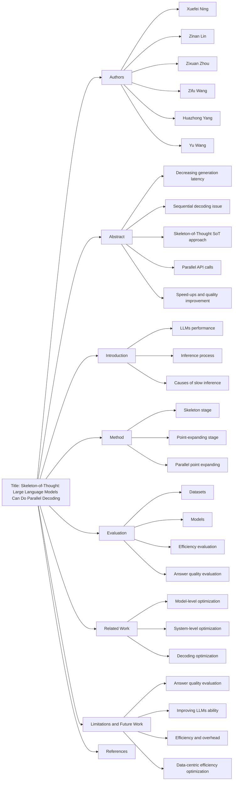

```mermaid
graph LR
    A[Title: Skeleton-of-Thought: Large Language Models Can Do Parallel Decoding]
    B[Authors]
    C[Abstract]
    D[Introduction]
    E[Method]
    F[Evaluation]
    G[Related Work]
    H[Limitations and Future Work]
    I[References]
    
    A --> B
    A --> C
    A --> D
    A --> E
    A --> F
    A --> G
    A --> H
    A --> I
    
    B --> B1[Xuefei Ning]
    B --> B2[Zinan Lin]
    B --> B3[Zixuan Zhou]
    B --> B4[Zifu Wang]
    B --> B5[Huazhong Yang]
    B --> B6[Yu Wang]
    
    C --> C1[Decreasing generation latency]
    C --> C2[Sequential decoding issue]
    C --> C3[Skeleton-of-Thought SoT approach]
    C --> C4[Parallel API calls]
    C --> C5[Speed-ups and quality improvement]
    
    D --> D1[LLMs performance]
    D --> D2[Inference process]
    D --> D3[Causes of slow inference]
    
    E --> E1[Skeleton stage]
    E --> E2[Point-expanding stage]
    E --> E3[Parallel point expanding]
    
    F --> F1[Datasets]
    F --> F2[Models]
    F --> F3[Efficiency evaluation]
    F --> F4[Answer quality evaluation]
    
    G --> G1[Model-level optimization]
    G --> G2[System-level optimization]
    G --> G3[Decoding optimization]
    
    H --> H1[Answer quality evaluation]
    H --> H2[Improving LLMs ability]
    H --> H3[Efficiency and overhead]
    H --> H4[Data-centric efficiency optimization]
```