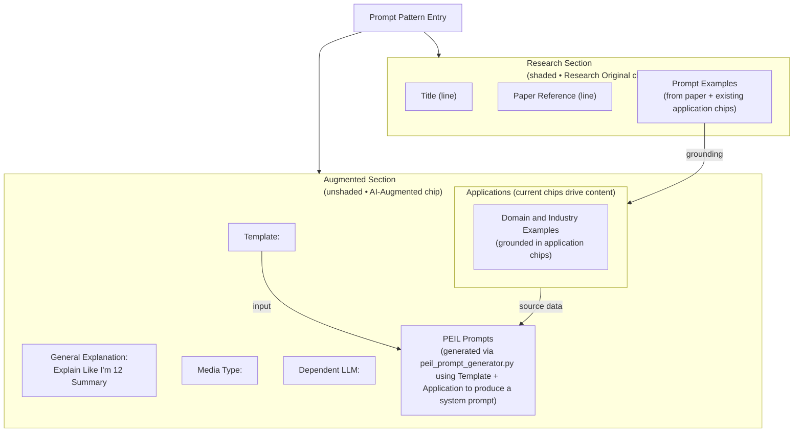

# Prompt Pattern Taxonomy

A comprehensive, searchable taxonomy of prompt engineering patterns for cybersecurity applications. This project provides an OED-style interface for discovering and learning prompt patterns extracted from research papers.

## 🎯 Project Overview

This is a Next.js-based web application that transforms academic research on prompt engineering into an accessible, searchable taxonomy. It serves as the definitive reference tool for prompt engineering patterns and is designed to help researchers, practitioners, students, and tool builders design safer, more evaluable prompts.

For the normalized Prompt Pattern schema and mapping details, see the Product Requirements Document (Prompt Pattern Schema section): docs/PRD.md.

### Key Features

- **Dictionary-Style Interface**: Clean, professional layout inspired by the Oxford English Dictionary
- **Advanced Search**: Full-text search with category filtering and fuzzy matching
- **Research Paper Integration**: Direct links to source papers with proper attribution
- **Pattern Categories**: Organized by Input Semantics, Output Customization, Security Testing, etc.
- **Copy-to-Clipboard**: Easy copying of prompt examples
- **Responsive Design**: Optimized for desktop and mobile devices
- **AI-Assisted Enrichment (Optional)**: Fill missing pattern fields with Azure OpenAI (GPT-5) and display an “AI-assisted” badge with disclaimer

### Recent UI/UX Updates

- **Unified Pattern View**: A shared PatternDetail component renders patterns identically on both paper pages and category pages.
	- Collapsible Template and Prompt Examples; defaults are compact and persist per pattern via localStorage
	- Example rows keep their ID badges; Template is shown as preformatted text when expanded
- **Similarity Surfacing**:
	- Per-example “Similar Examples” chips with IDs and similarity scores; links deep into the canonical paper example anchors
	- Fallback when example-level data is missing uses “Similar Patterns” mapped to each pattern’s first example
	- “Similar Patterns” section is collapsible and hidden by default on both paper and category pages
- **Deep-Linking & Permalinks**: All pattern/example links resolve to /papers routes using stable anchors
	- Patterns: `#p-{categoryIndex}-{patternIndex}`
	- Examples: `#e-{categoryIndex}-{patternIndex}-{exampleIndex}`
	- Category pages show an inline “Paper: Title” link next to the Permalink for quick source navigation
- **Matrix Semantics**: Matrix counts now reflect semantic similarity category assignments with robust fallback to original taxonomy when needed
- **Search UX**: Results categorized by type with filters, clean blank initial state, “Clear all,” and URL state persistence
- **Accessibility**: Improved contrast and chevron-based toggles with appropriate ARIA controls
 - **How to apply**: A concise 1–2 sentence usage summary is shown inline under Application when available; generated via optional enrichment.
 - **Orientation Layout (OED-Inspired)**: Refactored Orientation page to a two-column grid with a sticky numbered side navigation (desktop) and chip navigation (mobile). Introduced a dedicated **About** landing page for context, moving the navigational **Hub** to a sub-view to improve onboarding flow.
 - **Quick Start Scenario & Quick Paths (Phase 6 P1)**: Concrete defensive triage example with runnable prompt plus evaluation harness reference; Quick Paths panel exposes five intents (Defensive Patterns, Adapt an Existing Prompt, Evaluate Prompt Quality, Explore Similar Patterns, Improve Clarity) with keyboard navigation.
 - **Reading Time Badges (Phase 6 P1)**: Automated word-count heuristic adds dark‑mode aware badges across Orientation sections.
 - **Simplified Pattern Anatomy (Phase 6 P1)**: Collapsible descriptive overview + accessible alt text replacing more complex diagram for faster comprehension.
 - **Cross-Link Footers (Phase 6 P1)**: Lifecycle, Evaluation, and Adaptation pages include contextual "Related next step" navigational hints.
 - **Evaluation Harness Stub (Phase 6 P2)**: Copyable code block with aria-live feedback demonstrating assertion structure for prompt tests (experimental).
 - **Decision Tree Widget (Phase 6 P2)**: Feature-flagged interactive radiogroup mapping user goals to suggested pattern categories; keyboard operable.
 - **Anti-Pattern Remediation Table (Phase 6 P2)**: ≥5 corrective mappings (Anti-Pattern → Symptom → Recommended Pattern → Caution) added to Orientation.
 - **Glossary A–Z Jump Bar (Phase 6 P2)**: Accessible alpha index anchors accelerate term navigation.
 - **Cheat Sheet Page**: Added `/orientation/cheatsheet` printable condensed reference (5-Key template, lifecycle, evaluation metrics, anti‑patterns, responsible use).
 - **Accessibility & Responsible Use Section**: Dedicated section consolidating inclusive design, bias monitoring, provenance, and escalation guidance.
 - **Sticky Side Navigation**: IntersectionObserver-driven highlight state with scroll offset margin for unobscured anchored headings.
 - **Numbered Sections & Skip Link**: Added ordered heading numbering for cognitive mapping plus a skip-to-content link for keyboard and screen reader efficiency.
 - **Pattern Title Wrapping**: Removed legacy truncation so full pattern names are always visible for better information scent.
 - **Theme System Overhaul**: Replaced per-component hook with a centralized `ThemeProvider` managing Light / Dark / System (auto) / planned High-Contrast. Persists user-selected mode in `pe-theme` and the resolved applied mode (after system evaluation) in `pe-theme-effective`. Pre-hydration inline script sets both `data-theme` (effective) and `data-theme-mode` (selected) to eliminate flash-of-unstyled-theme (FOUC) and enable analytics on divergence between chosen and resolved modes. Cross-tab + system preference changes sync instantly via `storage` + `matchMedia` listeners.
 - **Deprecated Hook Removed**: Legacy `useTheme` hook fully removed; Jest updated to `next/jest` and Babel config dropped to restore SWC (improves build speed and resolves `next/font` conflict).
 - **Tokenized Dark Search Panel**: Homepage search interface migrated from fixed light colors to design tokens (bg-surface-*), ensuring seamless Dark/System mode parity.
 - **Application Task Chips**: New `applicationTasksString` rendered as actionable chips under “Application Domains and Tasks” on pattern detail views, complementing the narrative Application field.
 - **Data Preservation**: Normalization pipeline updated to non-destructively retain enriched fields (including `applicationTasksString`) across rebuilds.

#### Pattern Detail Layout Reference



```text
+--------------------------------------------------------------------+
| Prompt Pattern Entry                                               |
|                                                                    |
|  [Research Original]                                               |
|  +--------------------------------------------------------------+  |
|  | Title                                                       |  |
|  | Paper Reference                                             |  |
|  | Prompt Examples (drawn from paper + existing application    |  |
|  | chips to keep usage grounded)                               |  |
|  +--------------------------------------------------------------+  |
|                                                                    |
|  [AI Augmented]                                                    |
|  General Explanation: Explain Like I'm 12 Summary                  |
|  Media Type:                                                       |
|  Dependent LLM:                                                    |
|  Template:                                                         |
|                                                                    |
|  Applications (reuses current chips):                              |
|    - Domain and Industry Examples                                  |
|                                                                    |
|  PEIL Prompts (via peil_prompt_generator.py;                       |
|    use Template + Application to generate a PEIL-structured        |
|    system prompt ready for automation)                             |
+--------------------------------------------------------------------+
```

### Theming Architecture (Unified Layout & Tokens)

All pages now consume a single layout contract:

| Layer | Responsibility | Implementation |
|-------|----------------|----------------|
| Pre-hydration script | Eliminates theme FOUC by setting `data-theme` + `data-theme-mode` before React mounts | Inline `<script>` in `layout.tsx` |
| ThemeProvider | Stores selected & effective theme, syncs system + tabs | `src/components/ThemeProvider.tsx` |
| PageShell | Structural wrapper: min-h-screen, spacing, width variants (default / narrow / wide / full) | `src/components/layout/PageShell.tsx` |
| Design tokens | Semantic color + typography + spacing vars | `src/styles/theme.css` + `globals.css` |
| Utilities | Reusable surfaces & inputs (`surface-card`, `input-base`, `pill-filter`, `chip-filter`) | `theme.css` (CSS, not Tailwind @apply) |
| Regression tests | Guard against re‑introducing raw light backgrounds | `src/__tests__/theme.regression.test.tsx` |

Key utility semantics:
- `bg-base` sets the page background (`--color-bg-base`).
- `surface-card` neutral elevated surface using `--color-surface-1` with tokenized border & shadow.
- `surface-card-interactive` adds hover affordances & pointer.
- `input-base` unifies light/dark/HC inputs (border, radius, focus ring token usage).
- `pill-filter` & `chip-filter` standardize compact filter badges and active state styling.

Refactor outcomes:
- Removed page-specific gradient / gray wrappers (consistent dark & HC rendering).
- Eliminated majority of hardcoded `bg-white`, `bg-gray-50`, `text-gray-*` classes in favor of tokens; a minimal legacy override remains only for stray print or transitional elements.
- Centralized card & form styling decreased duplicate class chains (diff shows >100 LOC net simplification across pages).
- Added regression assertions ensuring future contributors do not regress dark mode consistency.

Extending the system:
- Add new surface tiers (e.g., `--color-surface-3`) or status hues by defining tokens and creating a matching utility.
- For complex interactive panels, compose from `surface-card` + bespoke component class instead of re‑inventing color values.
- To theme new components, prefer tokens (`var(--color-*)`) or existing utilities before introducing raw Tailwind color classes.

Migration note: If any legacy page/component still needs a rapid theme pass, wrap it in `PageShell` and replace light-mode background/border classes with either the appropriate utility or token CSS variables.

### Accessibility & Theming Roadmap (In Progress)

The project is formalizing a site-wide accessibility and readability strategy beyond the Orientation page. Key commitments and upcoming changes:

- **Standards Target**: WCAG 2.2 Level AA (with selective AAA where feasible: higher contrast, link purpose, visual presentation) + WAI-ARIA best practices.
- **Font Stack**: Use `system-ui, -apple-system, Segoe UI, Roboto, Helvetica, Arial, sans-serif` for performance, clarity, and user familiarity. (No non-essential web fonts.)
- **Design Tokens**: Introduce a centralized token layer (typography scale, spacing scale, color roles, focus ring, radii) consumed by Tailwind utilities and custom CSS vars.
- **Three Display Modes**: Light, Dark, and a distinct High-Contrast theme (not just dark with brighter colors) – user-selectable (stored in `pe-theme`) with resolved effective mode mirrored to `pe-theme-effective`; initial System selection respects `prefers-color-scheme` and records the evaluation.
- **Readability Controls**: UI panel to adjust font size (S / M / L), content width (narrow/normal), and theme/contrast; honors `prefers-reduced-motion`.
- **Consistent Prose Width**: Long-form text constrained to ~70–75ch for optimal line length; Orientation overview will remain optionally “all-in-one” but each section will also get its own dedicated page.
- **Hybrid Orientation Architecture**: Multi-page `/orientation/{slug}` entries (Quick Start, Anatomy, Lifecycle, Evaluation, Anti-Patterns, Responsible Use, Glossary, FAQ) + an “All Sections” overview + existing Cheat Sheet.
- **Navigation Enhancements**: Multiple skip links (to Main Content, Section Navigation, Search). Landmarks (`header`, `nav`, `main`) and ARIA labels clarified.
- **Interactive Components Audit**: Standardize collapsibles/disclosures, chips, copy buttons, and similarity toggles with proper `<button aria-expanded>` semantics and visible focus states.
- **Live Regions**: Polite announcements for copy success, search result count changes, and user preference changes (font size, theme).
- **Accessibility Automation**: axe-core + (optional) Playwright keyboard traversal tests integrated into CI, failing builds on critical/serious violations.
- **Documentation**: A new `docs/ACCESSIBILITY.md` file (added) tracks the checklist, rationale, exceptions, and testing tooling.
- **Footer (OED-Inspired)**: Planned global footer with grouped links (About, Using the Taxonomy, Accessibility Statement, Data & Provenance, License, Feedback) and a brief provenance note for AI-assisted fields.

These items will roll out incrementally; PRD has been updated with the new requirements. Automated verification: `tests/themePersistence.test.tsx` asserts persistence keys and DOM attributes after remount to guard against regressions.

## 🚀 Quick Start

### Prerequisites

- Node.js 18+ 
- npm or yarn

### Installation

```bash
# Clone the repository
git clone https://github.com/timhaintz/PromptEngineering4Cybersecurity.git

# Navigate to the project
cd PromptEngineering4Cybersecurity/prompt-pattern-dictionary

# Install dependencies
npm install

# Process the source data
npm run build-data

# Start the development server
npm run dev
```

Open [http://localhost:3000](http://localhost:3000) to view the taxonomy.

### First-Time User Guide

If you're new to the project or to prompt patterns, start here after you have the app running locally:

1. Open the **Orientation** section from the main navigation and skim **Quick Start** for a high-level overview.
2. Visit **Pattern Anatomy** under Orientation to understand how each pattern is structured (Description, General Explanation, Usage Summary, Template, Knowledge Intent, PEIL, etc.).
3. Use the homepage search to find a pattern related to a domain you care about (e.g., "triage", "classification", "hypothesis").
4. On a pattern page:
	- Locate the Pattern ID badge and the research-derived Description.
	- Expand the Template and (optionally) the PEIL prompt.
	- Copy a Prompt Example and adapt it for a small, safe test task.
5. Check any **Similar Patterns/Examples** listed, noting how their Templates and Applications differ.
6. Before using anything in production, review the **Responsible Use** page (`/responsible-use`) to understand acceptable use, safety constraints, and reporting paths.

Orientation also includes guidance on interpreting similarity scores and using the knowledge intent quadrants when choosing patterns.

### Start in production

To run the site in production mode (optimized build):

```bash
# Build & serve the static export (includes data processing & semantic artifacts)
npm run start

# Already have an up-to-date build? Serve it without rebuilding.
npm run preview
```

## 📁 Project Structure

```
prompt-pattern-dictionary/
├── src/
│   ├── app/              # Next.js App Router pages
│   ├── components/       # Reusable React components
│   ├── lib/             # Utilities and data processing
│   └── types/           # TypeScript definitions
├── public/
│   └── data/            # Processed pattern data
├── scripts/             # Build and data processing scripts
└── docs/                # Project documentation
```

## 🔧 Development

### Available Scripts

- `npm run dev` - Start development server
- `npm run build` - Build for production
- `npm run start` - Build the site and serve the exported static output
- `npm run preview` - Serve the existing `out/` directory without rebuilding
- `npm run build-data` - Process source JSON into optimized format
- `npm run lint` - Run ESLint
- `npm test` - Run tests

### Data Processing

The application processes `../promptpatterns.json` to create:
- Individual pattern pages
- Search indexes
- Category listings
- Cross-references

#### Data Files and Semantics

Processed artifacts in `public/data/` include:

- `normalized-patterns.json`: Normalized attributes per pattern (mediaType, dependentLLM, application, turn, template)
	- When enrichment is enabled, may also include: `usageSummary`, `applicationTasksString`, `knowledgeIntent`, `aiAssisted`, `aiAssistedFields`, `aiAssistedModel`, `aiAssistedAt`
- `semantic-assignments.json`: Best semantic category assignments and scores used to compute matrix counts
- `similar-examples.json`: Example-level similarity edges with top-k matches and scores
- `similar-patterns.json`: Pattern-level similarity edges with top-k matches and scores
- `stats.json`: Summary counts and last processing timestamp

Notes:
- Deep-links are canonicalized to `/papers/{paperId}` anchors for both patterns and examples
- When example-level similar data is absent, the UI falls back to similar patterns and links to the first example of each similar pattern

**Commit policy for data files**: The data files in `public/data/` are regenerated by `npm run build-data` and each build updates their internal timestamps (e.g. `lastProcessed`, `generatedAt`). Only commit changes to these files when the upstream source data (`promptpatterns.json`) has actually changed. Timestamp-only changes from routine rebuilds should **not** be committed.

### Optional AI Enrichment (GPT-5)

You can optionally enrich normalized pattern data using Azure OpenAI (GPT-5) to fill gaps in the AI-augmented metadata while preserving the research-authoritative fields. The Template (Role, Context, Action, Format, Response) now ships directly from the source papers via normalization; GPT-5 uses that template—along with application tags and prompt examples—to add whatever is missing (usage summary, dependent LLM call-outs, turn guidance, PEIL-formatted system prompt, domain/industry pairings).

- What it does:
	- Updates `public/data/normalized-patterns.json`
	- Adds metadata: `aiAssisted`, `aiAssistedFields`, `aiAssistedModel`, `aiAssistedAt`
	- Treats the research-derived Template as read-only; the enrichment pass only supplements adjacent AI fields
	- Uses GPT-5 to inspect the full record (research excerpt, template, application chips, prior enrichment) and synthesize a hybrid PEIL system prompt (framing paragraph + unlabeled bullet rules with one domain-focused scenario woven into the guidance) plus `Domain and Industry Examples`. The scenario stays within a single domain and will not mix multiple industries.
	- Pattern pages show an “AI-assisted” badge and a small disclaimer noting fields may be incorrect

- Scope to fields:

You can restrict enrichment to only certain fields using `--enrich-fields` with a comma-separated list. Allowed values: `template,application,dependentLLM,turn,usageSummary`. Because the template is now populated during normalization, only use the `template` option for manual overrides.

- How to run (npm):

```bash
# Add -- after the script name to pass flags through npm
npm run build-data -- --enrich

# Limit enrichment to first 25 patterns
npm run build-data -- --enrich --enrich-limit 25

# Enrich only template and application fields
npm run build-data -- --enrich --enrich-fields template,application
```

- How to run (Node directly):

```bash
node scripts/build-data.js --enrich
node scripts/build-data.js --enrich --enrich-limit 25
node scripts/build-data.js --enrich --enrich-fields template,application,usageSummary
```

- Command help:

```powershell
python prompt-pattern-dictionary/scripts/enrich-normalized-pp.py --help
```

Displays a CLI reference for all enrichment flags, including preview mode.

- Using uv for Python steps (Windows PowerShell):

The build auto-detects uv and prefers `uv run` for Python scripts (embeddings, categorization, enrichment). To force uv explicitly in PowerShell:

```powershell
$env:USE_UV = "1"
node .\scripts\build-data.js --enrich --enrich-fields template --enrich-limit 5
```

- Dry run previews (Python):

```powershell
python prompt-pattern-dictionary/scripts/enrich-normalized-pp.py --limit 10 --fields generalExplanation,peilPrompt --dry-run
```

The `--dry-run` flag calls Azure and prints the exact field updates without writing back to `public/data/normalized-patterns.json`.

- Preview mode (bypass skip logic and stay read-only):

```powershell
python prompt-pattern-dictionary/scripts/enrich-normalized-pp.py --limit 5 --fields application,usageSummary --preview --show-raw
```

`--preview` forces a model call for the requested fields even when data already exists and implicitly enables `--dry-run` so nothing is written. Pair with `--show-raw` to display the verbatim model response alongside the normalized preview output.

- GPT-5 temperature behavior:

Azure GPT-5 deployments accept only the default temperature. The enrichment pipeline does not set `temperature` explicitly for GPT-5 (and will retry without it if the service rejects the parameter), so you won’t see 400 errors about unsupported temperature values. Each enrichment call includes the locked-in Template and application context so the model stays grounded while crafting the PEIL-formatted system prompt.

- Requirements:
	- Azure environment variables for endpoints/models must be set according to your `azure_models.py` registration
	- Authentication uses Azure Identity’s Interactive Browser Credential with secure token caching; you may be prompted to sign in via browser
	- No embeddings are regenerated by this step

#### New: Application Task Strings (`applicationTasksString`)

A structured, compact field capturing 1–8 concise, actionable tasks (comma+space separated) that illustrate how a pattern can be operationalized across multiple domains.

Design goals:
- Preserve original `application` narrative (1–2 concise sentences) for human scanning.
- Add a machine/comparison friendly task string: `task1, task2, ...`.
- Provide both general and domain‑specific coverage per pattern without overwhelming the UI.

Rules enforced by the enrichment pipeline:
- 1–8 tasks (prefer 8 when confident).
- Each task ≤ 5 words (longer ones are truncated to first 5 tokens).
- DISTINCT (case‑insensitive de‑dupe) and trimmed.
- ACTIONABLE & VERB‑LED (imperative phrasing) unless a noun form is inherently sufficient (e.g., "firewall log triage").
- REQUIRED DISTRIBUTION: 3–4 general cross‑domain actions + 4–5 domain/industry specific activities referencing DIFFERENT domains (finance, insurance, healthcare, legal, cybersecurity, supply chain, education, etc.), with at most 2 tasks per domain.
- Prefer concrete entities (claim, invoice, patient record, contract, firewall log) over abstractions.
- Post‑processing diversification limits overuse of a single generic opener (e.g., replaces repeated "Clarify user intent" with variants like "Elicit missing details", "Identify user goal").

Example (formatted as stored):
```
clarify user intent, map tokens to actions, confirm notation understanding, tag invoice line items, annotate patient record fields, label insurance claim statuses, mark contract clause references, parse firewall log events
```

UI Rendering:
- Displayed (when present) beneath the Application section of a pattern as a horizontal / wrapping set of compact chips.
- Chips are order-preserving, non-interactive today (future enhancement: clickable task → filtered search).
- Complements (does not replace) the narrative `application` sentences for human-readable context.

#### Enrichment Flags for Task Generation

Run only the task generation (no other fields):
```powershell
python prompt-pattern-dictionary/scripts/enrich-normalized-pp.py --applicationtasks-only
```
Force regeneration even if a value already exists:
```powershell
python prompt-pattern-dictionary/scripts/enrich-normalized-pp.py --applicationtasks-only --force-applicationtasks
```
Target specific pattern IDs:
```powershell
python prompt-pattern-dictionary/scripts/enrich-normalized-pp.py --applicationtasks-only --force-applicationtasks --ids 0-0-0,0-1-2,0-3-1
```

#### Implementation Notes
- `SYSTEM_PROMPT` encodes distribution & style constraints; logic normalizes + truncates.
- A diversification pass rotates a small synonym set after the first use of a generic phrase.
- Future work (optional): domain coverage validator & casing harmonizer.

#### New: Knowledge Intent Quadrants (`knowledgeIntent`)

Each pattern can now be tagged with its primary knowledge flow using the `knowledgeIntent` field. Labels are drawn from a fixed set:

- **Refinement & Clarification** – both human and AI know the subject; prompts polish, validate, or reframe knowledge.
- **Knowledge Retrieval** – human is unsure, AI supplies concrete answers drawn from its corpus.
- **Co-Discovery & Exploration** – neither side starts with the answer; prompts promote brainstorming and hypothesis testing.
- **AI Tutoring & Tuning** – human teaches or aligns the AI with domain expertise, preferences, or guardrails.

Use `scripts/backfill_knowledge_intent.py` to classify existing data. It reuses the GPT-5 powered `KnowledgeIntentClassifier` and writes labels back into `public/data/normalized-patterns.json` (with optional caching):

```powershell
python prompt-pattern-dictionary/scripts/backfill_knowledge_intent.py --dry-run --limit 10
python prompt-pattern-dictionary/scripts/backfill_knowledge_intent.py --force --cache-file tmp/knowledge_intent_cache.json
```

The enrichment pipeline (`enrich-normalized-pp.py`) now understands `--fields knowledgeIntent` and will invoke the same classifier automatically whenever the field is requested or forced, ensuring consistent labels across manual backfills and AI-assisted runs.

## 📚 Documentation

- [Product Requirements Document](docs/PRD.md)
- [Folder Structure Guide](docs/FOLDER_STRUCTURE.md)
- [API Documentation](docs/API.md)
- [Deployment Guide](docs/DEPLOYMENT.md)
- [Theming & Design Tokens (Canonical)](docs/THEMING.md)
- [Accessibility & Readability Program](docs/ACCESSIBILITY.md)

> Note: `docs/THEMING.md` and `docs/ACCESSIBILITY.md` are the single sources of truth. Any theming or accessibility changes must update those files. No other copies should exist elsewhere in the repository.

## 🧭 Orientation Phase Progress (Phase 6)

Current multi-sprint Orientation enhancement status (Phase 6):

| Sub-Sprint | Status | Highlights |
|------------|--------|-----------|
| P0 Trust & Accessibility | Completed | Provenance badge unification, skip links, axe baseline (zero serious/critical), focus outline consistency |
| P1 Onboarding & Quick Paths | Completed | Concrete Quick Start scenario, Quick Paths (5 intents), reading time badges, cross-links, simplified Pattern Anatomy overview |
| P2 Depth & Evaluation Tools | Completed | Evaluation harness stub (copyable, aria-live), Decision Tree widget (feature-flag), Anti-Pattern remediation table, Glossary A–Z index |
| P3 Interactive Teasers | Planned | Similarity preview callout, adaptation/evaluation loop diagram, optional network sample graph |
| P4 Polish & Consolidation | Planned | Cheat Sheet refinements, high-contrast audit, redundancy cleanup, ACCESSIBILITY.md audit log update |
| P5 Continuous Learning | Planned | Feedback CTA rollout, telemetry event schema, GitHub triage labels |

Sub-sprints P0–P2 are locked; future changes require regression tickets referencing completion date (2025-11-09). See `docs/PRD.md` for acceptance criteria details.

## 🌐 Deployment

This project is configured for deployment to GitHub Pages:

```bash
npm run build
npm run export
```

The static files will be generated in the `out/` directory, ready for GitHub Pages hosting.

### Deep-Linking Behavior (Static Export)

When exporting statically, deep links of the form `/papers/{paperId}#p-{c}-{p}` and `/papers/{paperId}#e-{c}-{p}-{e}` continue to resolve correctly in the generated `out/` bundle. Category-page links always route to the canonical paper anchor to avoid dead links.

## 🤝 Contributing

1. Fork the repository
2. Create a feature branch (`git checkout -b feature/amazing-feature`)
3. Commit your changes (`git commit -m 'Add amazing feature'`)
4. Push to the branch (`git push origin feature/amazing-feature`)
5. Open a Pull Request

## 📄 License

This project is licensed under the MIT License - see the [LICENSE](LICENSE) file for details.

## 🙏 Acknowledgments

- Research papers and authors whose work is cataloged in this taxonomy
- The prompt engineering and cybersecurity communities
- Contributors to the open-source ecosystem

## 📞 Support

For questions or support, please open an issue in the GitHub repository.
