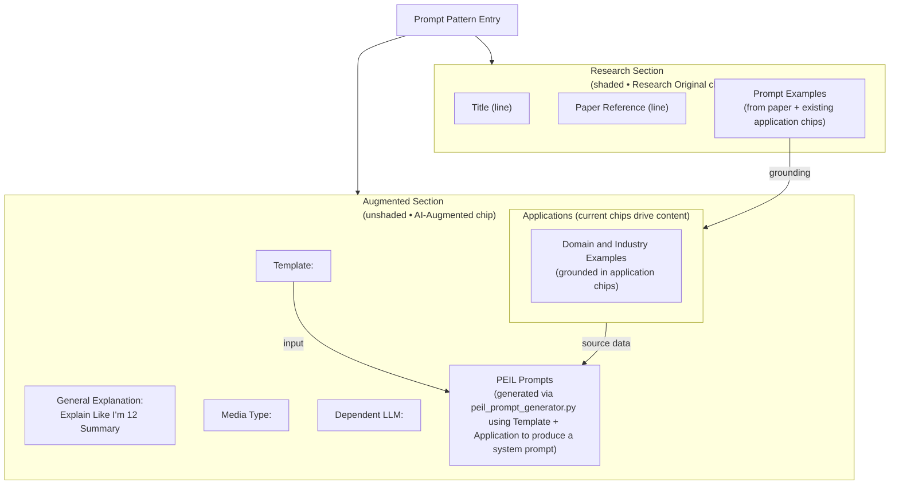

# Product Requirements Document: Prompt Pattern Dictionary & Search Interface

## Executive Summary

We are developing a comprehensive, dictionary-style search interface for prompt patterns and examples extracted from cybersecurity and prompt engineering research papers. This will be a GitHub-hosted web application that provides an intuitive, searchable database of prompt patterns similar to the Oxford English Dictionary (OED) experience, but focused on prompt engineering patterns for cybersecurity applications.

## Product Vision

Create the definitive reference tool for cybersecurity prompt engineering patterns - a searchable, discoverable, and educational resource that serves as both a learning platform and practical reference guide for prompt engineers, researchers, and cybersecurity professionals.

## Background & Context

- **Data Source**: `../promptpatterns.json` - A curated database of prompt patterns extracted from 72+ research papers
- **Current Structure**: Hierarchical JSON with Papers → Categories → Patterns → Examples
- **Index System**: Each prompt has a unique index (e.g., "1-0-2-0" for Paper 1, Category 0, Pattern 2, Example 0)
- **Target Repository**: https://github.com/timhaintz/PromptEngineering4Cybersecurity (currently private)

## Target Users

### Primary Users
- **Prompt Engineers**: Professionals designing and optimizing prompts for LLMs
- **Cybersecurity Researchers**: Academic and industry researchers working with AI/ML in security
- **Security Practitioners**: SOC analysts, penetration testers, security engineers using AI tools

### Secondary Users
- **Students**: Learning prompt engineering and cybersecurity concepts
- **Developers**: Building AI-powered security tools
- **Compliance Teams**: Understanding AI safety and security patterns

## Core Features & Requirements

### 1. Search & Discovery

#### 1.1 Advanced Search Functionality

#### 1.2 Browse & Navigation

#### 1.3 First-Time User Onboarding (Added)

Provide an explicit, low-friction path for new visitors to understand what the site is, who it is for, and how to complete a first successful session.

- **Tagline & Audience Mapping**: Display a concise positioning statement near the homepage hero and Orientation hub header (e.g., "A research-grounded prompt pattern dictionary for building safer, evaluable AI prompts"), plus a short mapping of common roles (Researcher, Practitioner, Student, Tool Builder) to typical intents.
- **Five-Minute Tour**: Orientation "Quick Start" section must include a numbered checklist guiding a complete mini-journey:
  1. Search for a pattern using domain keywords.
  2. Open a pattern page and locate the Pattern ID badge.
  3. Expand the Template (5-key) and optional bracketed form.
  4. Copy a Prompt Example and adapt it with project-specific variables.
  5. Inspect Similar Patterns/examples and note differences.
  6. Run a small evaluation harness (example snippet) and record outcomes.
- **Role-Based Entry Points**: Quick Paths panel should explicitly label which cards are best for Researchers (e.g., comparison & similarity exploration), Practitioners (defensive patterns, evaluation), Students (What is a Pattern, Glossary), and Tool Developers (Playground, embeddings).
- **Expectation Setting**: Early Orientation copy must clearly state that the site is a static, research-derived dictionary and does not run live model calls in the browser (similarity and enrichment are precomputed).

Acceptance:
1. A first-time user can reach and complete the Five-Minute Tour without reading the full PRD.
2. Landing and Orientation pages both state purpose and target audiences in ≤2 sentences.
3. User stories for Researchers, Practitioners, Students, and Tool Developers are linked from Orientation and discoverable within 2 clicks from the homepage.
### 2. Dictionary-Style Interface

#### 2.1 Pattern Entry Display
- **Pattern name** as primary heading
- **Pronunciation guide** for complex terms (if applicable)
- **Definition/Description** with clear, concise explanation
- **Category classification** and subcategories
- **Etymology** (source paper, authors, publication date)
- **Usage examples** with syntax highlighting
- **Cross-references** to related patterns
- **Security implications** and warnings where relevant

##### 2.1.1 Prompt Pattern page layout (UI spec)
Applies to Prompt Pattern pages only.

- Remove the "Pattern Metadata" header block entirely.
- Keep and display the Pattern ID near the title area as a muted badge: `ID: <patternId>` (e.g., `ID: 1-1-0`).
- Present the following keys in a single left-column label layout with bold labels and values on the right:
  - Media Type:
  - Dependent LLM:
  - Application: (render tags inline on the same line, as chips/pills; do not wrap label to a new line)
  - Turn:
  - Template:
- Recommended markup: definition list `<dl>` with `<dt>` for the left column and `<dd>` for the right column; recommended fixed label width (e.g., 10–12ch) so values align.
- Styling guidance (Tailwind): `grid grid-cols-[max-content_1fr] gap-x-4 gap-y-1`, `dt font-semibold text-slate-700 dark:text-slate-200`.
- Template value supports multiline code/prompt; collapse after ~3 lines with a "Show more" control for long content.

##### 2.1.2 AI Augmented metadata block (PEIL prompts)

- Render an `AI Augmented` chip at the top of the enrichment block; retain the shaded background contrast agreed during layout reviews so provenance remains visually distinct from the research section.
- Field order (all optional, show all labels even when values are absent):
  - `General Explanation` - Explain Like I'm 12 summary (one short paragraph synthesised from research facts)
  - `Media Type`
  - `Dependent LLM`
  - `Template` (always the research-derived template string; never regenerate this field during enrichment)
  - `Domain and Industry Examples` (chips sourced by pairing the Template with existing application tags)
  - `PEIL Prompts`
- The Template value is already captured from the source papers during normalization and must be treated as the authoritative text. Enrichment steps may only fill gaps around it, not rewrite it.
- When enrichment runs, call GPT-5 with the full pattern record (research excerpt, template, application metadata, prior AI fields). The model confirms existing values, then assembles a complete PEIL system prompt and flags unclear items instead of fabricating unsupported claims.
- Domain and industry examples are selected by crossing the Template with the application chips found in the research data; GPT-5 may suggest alternates only when a chip is missing, and should note when manual review is required.
- PEIL prompt generation always grounds itself in the Template plus the chosen application/domain pairing. GPT-5 returns a hybrid PEIL system prompt with a framing paragraph followed by unlabeled bullet rules, weaving in a single domain-specific scenario (never mixing domains) so downstream automation receives a ready-to-use instruction block aligned with the Bomble et al. (2025) and Han, Wu & Willard (2025) guidance.



```text
+--------------------------------------------------------------------+
| Prompt Pattern Entry                                               |
|                                                                    |
|  [Research Original]                                               |
|  +--------------------------------------------------------------+  |
|  | Title                                                       |  |
|  | Paper Reference                                             |  |
|  | Prompt Examples (drawn from paper + existing application    |  |
|  | chips to keep usage grounded)                               |  |
|  +--------------------------------------------------------------+  |
|                                                                    |
|  [AI Augmented]                                                    |
|  General Explanation: Explain Like I'm 12 Summary                  |
|  Media Type:                                                       |
|  Dependent LLM:                                                    |
|  Template:                                                         |
|                                                                    |
|  Applications (reuses current chips):                              |
|    - Domain and Industry Examples                                  |
|                                                                    |
|  PEIL Prompts (via peil_prompt_generator.py;                       |
|    use Template + Application to generate a PEIL-structured        |
|    system prompt ready for automation)                             |
+--------------------------------------------------------------------+
```

#### 2.2 Example Management
- **Multiple examples** per pattern with individual indexing
- **Code/prompt formatting** with syntax highlighting
- **Copy-to-clipboard** functionality
- **Example variations** and modifications
- **Context explanations** for complex examples

##### 2.2.1 Prompt Examples section behavior
- The entire "Prompt Examples (N)" section is collapsible via a +/- toggle button next to the section heading.
  - Default state: expanded. Remember the last state per pattern in `localStorage`.
  - Accessibility: use a `<button aria-expanded>` control; update `aria-controls` to point at the examples container.
- Each prompt example row/card includes a control to expand/collapse its "Similar Examples" list.
  - Use a chevron or +/- icon at the right end of the example header. Default state: collapsed.
  - When expanded, show a horizontal list of chips containing `ExampleID SimilarityScore` (e.g., `1-1-2-0 0.54`). Clicking a chip navigates to that example.
  - Keep the Prompt Example ID visible on the example itself (as a small badge near the example title/first line).

##### 2.2.2 Prompt Example card template (UI)
Structure and required elements for each example in the list/grid:

- Header row
  - [Badge] Example ID (e.g., `1-1-0-0`)
  - [Title/First line] Truncated first sentence of the prompt (or explicit example title, if present)
  - [Actions]
    - Copy button (copies the full prompt text)
    - Expand Similar Examples toggle (chevron or +/-)
- Body
  - Prompt text with syntax highlighting; preserve whitespace and code fences
  - Optional context/notes below the prompt, if available
- Similar Examples panel (collapsible)
  - Chips: `ExampleID Score` (score to two decimals). On hover, show full example name; on click, navigate.
  - For long lists, enable horizontal scroll on small screens.
- Accessibility
  - All interactive icons are buttons with labels (`aria-label`, `title`).
  - Keyboard: Enter/Space toggles collapsibles; copy button is focusable.
  - Provide `aria-live="polite"` toast/snackbar when a copy action succeeds.

### 3. Content Organization

#### 3.1 Hierarchical Structure
```
Research Paper
├── Paper Metadata (Title, Authors, APA Reference, URL, Date Added)
├── Categories
│   ├── Category Name
│   ├── Pattern Collection
│   │   ├── Pattern Name
│   │   ├── Pattern Description
│   │   └── Example Prompts
│   │       ├── Example 1
│   │       ├── Example 2
│   │       └── Example N
```

#### 3.2 Indexing System
- **Maintain existing index format**: `{paperId}-{categoryIndex}-{patternIndex}-{exampleIndex}`
- **Permalink structure**: `/pattern/{index}` or `/pattern/{paper}/{category}/{pattern}`
- **Canonical URLs** for each pattern and example

### 4. User Experience Features

#### 4.1 Reading Experience
 **Display Modes**: Three modes: Light, Dark, High-Contrast (distinct palette, ≥7:1 text contrast). High-Contrast is not just Dark with brighter text. Centralized `ThemeProvider` persists selected mode in `pe-theme` and resolved effective variant (after system match) in `pe-theme-effective`; pre-hydration inline script sets `data-theme` + `data-theme-mode` to eliminate FOUC.
- **Dark/Light mode** toggle
- **Font size adjustment** for accessibility
 - Reworked theming with centralized `ThemeProvider` (Light / Dark / System, High-Contrast scaffold) + zero-FOUC pre-hydration script setting `data-theme` (effective) and `data-theme-mode` (selected). Dual storage keys: `pe-theme`, `pe-theme-effective`; dark-mode parity for homepage search panel; cross-tab + system preference sync.
- **Bookmark functionality** for favorite patterns
- **Reading progress** tracking

##### 4.1.1 Accessibility & Readability Expansion (Added)

Site-wide accessibility commitments (phase rollout) aligning with WCAG 2.2 Level AA + selective AAA and ARIA Authoring Practices:

- **Standards**: WCAG 2.2 AA minimum; attempt AAA for contrast (1.4.6/1.4.8) and link purpose (2.4.9) where reasonable.
- **Font Stack**: `system-ui, -apple-system, Segoe UI, Roboto, Helvetica, Arial, sans-serif` (fast, familiar, user OS rendering).
- **Base Typography**: Clamp base size to 17–18px with line-height ~1.55; semantic CSS variable tokens (e.g., `--font-size-sm`, `--font-size-base`, `--font-size-lg`).
- **Line Length**: Long-form prose (orientation, docs) constrained to 70–75ch; pattern tables/examples exempt.
- **Display Modes**: Three modes: Light, Dark, High-Contrast (distinct palette, ≥7:1 text contrast). High-Contrast is not just Dark with brighter text.
- **User Controls**: Single global theme / contrast switcher in primary navigation (Light, Dark, System; High-Contrast forthcoming). Removed per‑page font/width controls in favor of native browser zoom / reader features; motion preferences honor `prefers-reduced-motion`.
- **Skip Links**: At least: Skip to Main, Skip to Section Navigation (when present), Skip to Search.
- **Landmarks**: Single `<main>` per page; labeled navs (e.g., `<nav aria-label="Primary">`, `<nav aria-label="Orientation sections">`).
- **Focusable & Visible**: Consistent 2px outline for all interactive elements, tokenized per theme; no focus suppression.
- **Disclosures**: Collapsible sections and example panels use `<button aria-expanded>` + `aria-controls` semantics; state persisted where helpful.
- **Live Regions**: `aria-live="polite"` for copy success, search result count changes, preference updates (e.g., “Font size set to Large”).
- **Interactive Chips**: Converted to `<a>` (navigation) or `<button>` (action); no reliance on color alone for selection.
- **Provenance**: AI-assisted fields surfaced with badge linking to explanation; footer carries disclaimer.
- **Automation**: Integrate axe-core scan in CI (core routes: home, search, pattern detail, orientation overview, cheat sheet) failing build on critical/serious issues.
- **Documentation**: Maintain `docs/ACCESSIBILITY.md` with WCAG mapping, exceptions, audit dates, regression checklist.
- **Performance Budget**: Readability/theming script <5KB gzipped; avoid layout shift >0.1 CLS.
- **Orientation Hybrid**: Multi-page `/orientation/{slug}` plus consolidated “All Sections” page; legacy hash anchors redirect.

Acceptance (Phase 1):
1. Lighthouse Accessibility ≥95 on home, search, pattern detail (Light & Dark).
2. axe-core: zero critical/serious issues on audited pages.
3. Theme + font size persisted & restored on reload.
4. Skip links keyboard accessible & visible.
5. All disclosures keyboard operable with correct `aria-expanded` state.

#### 4.2 Interactive Elements
- **Interactive examples** where users can modify prompts
- **Copy examples** with attribution
- **Share functionality** (direct links, social media)
- **Comment system** for community feedback (future consideration)
- **Rating system** for pattern usefulness

##### 4.2.1 Search & Similarity Guidance (Added)

- **Search Syntax Hints**: Provide inline helper text and Orientation section documenting supported query modes (plain keyword, category-focused search) and clearly indicate that advanced boolean operators and auto-complete are planned but not yet implemented.
- **Similarity Score Legend**: Orientation and comparison surfaces must include a short legend interpreting similarity values (e.g., ≥0.70 high structural overlap; 0.50–0.69 related variants; <0.50 exploratory only) so first-time users can contextualize numbers.
- **Knowledge Intent Usage**: Document how the four knowledge intent quadrants (Refinement & Clarification, Knowledge Retrieval, Co-Discovery & Exploration, AI Tutoring & Tuning) should influence user decisions (e.g., which patterns to pick when the goal is discovery vs hard-fact retrieval). Even before UI facets exist, Orientation should describe recommended usage patterns.
- **Manual Comparison Workflow (Pre-Feature)**: Until interactive comparison matrices ship, Orientation should outline a manual comparison recipe: open two patterns, compare Template keys, examine Application/Usage Summary differences, and log qualitative similarity in a simple change log.

Acceptance:
1. Search results page links to Orientation "Search & Similarity" guidance section.
2. At least one Orientation section contains a similarity legend and knowledge intent usage examples.
3. Users can discover a documented manual comparison workflow in ≤2 clicks from Orientation.

### 4.3 Semantic Similarity & Pattern Comparison

#### 4.3.1 Real-Time Pattern Comparison
- **Multi-Pattern Selection**: Compare 2-10 patterns or examples simultaneously
- **Cosine Similarity Calculation**: Real-time similarity scoring using pre-computed embeddings
- **Interactive Selection**: Checkbox-based pattern selection from search results or categories
- **Comparison Matrix**: Visual similarity matrix with color-coded scores
- **Export Results**: Download comparison data for research analysis

#### 4.3.2 Prompt Testing Playground
- **Free-Text Input**: Users can paste their own prompts for comparison
- **Live Embedding Generation**: Real-time embedding generation for user input via Azure OpenAI
- **Similarity Ranking**: Rank existing patterns by similarity to user's prompt
- **Confidence Indicators**: Show similarity scores with confidence levels
- **Pattern Recommendations**: Suggest most similar patterns from research database

#### 4.3.3 Visualization Components
- **Similarity Heatmap**: Color-coded matrix showing pairwise similarities
- **Scatter Plot Visualization**: 2D projection of embedding space using dimensionality reduction
- **Network Graph**: Show relationship networks between similar patterns
- **Similarity Timeline**: Track how pattern similarity evolves across research papers
- **Category Distribution**: Show how user's prompt relates to different logic categories

#### 4.3.4 Comparison Features
- **Pattern vs Pattern**: Compare research patterns from the database
- **Example vs Example**: Compare specific prompt examples within patterns
- **User Prompt vs Database**: Compare user's input against all research patterns
- **Batch Comparison**: Upload multiple prompts for bulk similarity analysis
- **Cross-Paper Analysis**: Compare patterns across different research papers

#### 4.3.5 Research Tools
- **Similarity Threshold Controls**: Adjustable thresholds for filtering results
- **Statistical Analysis**: Mean, median, and distribution of similarity scores
- **Clustering Visualization**: Automatic grouping of similar patterns
- **Export Functionality**: Download similarity matrices in CSV/JSON for further analysis
- **Citation Integration**: Automatic citation generation for compared patterns

### 5. Technical Architecture

#### 5.1 Frontend
- **Framework**: React.js or Vue.js for interactive components
- **Static Site Generator**: Next.js, Gatsby, or VitePress for optimal performance
- **Styling**: Tailwind CSS or styled-components for responsive design
- **Search**: Client-side search with Lunr.js or Flexsearch
- **Hosting**: GitHub Pages with custom domain

#### 5.2 Data Management
- **Source Data**: `../promptpatterns.json` as single source of truth
- **Build Process**: Automated generation of search indexes and static pages
- **Content Validation**: Schema validation for data integrity
- **Version Control**: Git-based content management

#### 5.3 Performance Requirements
- **Page Load Time**: < 3 seconds for initial load
- **Search Response**: < 500ms for search results
- **Mobile Performance**: Lighthouse score > 90
- **Offline Capability**: Service worker for cached content
- **Similarity Calculation**: < 200ms for 2-10 pattern comparison
- **Playground Response**: < 1 second for user prompt similarity search
- **Embedding Generation**: < 3 seconds for user prompt embedding via Azure OpenAI
- **Visualization Rendering**: < 500ms for heatmaps and scatter plots
- **Export Generation**: < 2 seconds for comparison data export
 - **Accessibility Bundle (Added)**: Theme/readability enhancement JS < 5KB gzipped, deferred; axe scan runtime <15s in CI.

### 6. Global Footer (Added)

Introduce an OED-inspired footer on every page:

- **Sections**: About • Using the Dictionary • Accessibility & Responsible Use • Data & Provenance • Contribute • License & Legal.
- **Elements**: Version/build timestamp, GitHub repo link, AI-assisted disclaimer, link to `ACCESSIBILITY.md` and orientation cheat sheet.
- **Structure**: `<footer role="contentinfo">` with semantic headings (no skipped levels) and lists of links.
- **Mobile**: Each section collapsible (disclosure pattern) to reduce vertical scroll.
- **Accessibility**: Each disclosure uses `<button aria-expanded>`; focus order remains logical; all links have descriptive text.
- **Contrast**: Meets defined contrast in Light, Dark, and High-Contrast themes.

Footer Acceptance:
1. Keyboard only user can access all footer links without encountering off-screen focus.
2. High-Contrast palette passes ≥7:1 for body text and ≥4.5:1 for link text.
3. AI provenance disclaimer clearly stated and programmatically associated with badge via `aria-describedby` where used.

### 7. First-Time User Journey & Safety (Added)

Define a coherent onboarding experience and lightweight safety checks so new users can quickly understand, try, and responsibly extend the system.

- **Onboarding Checklist**: Orientation must include a short checklist (Five-Minute Tour) for a first visit.
- **Description vs General Explanation vs Usage Summary**: Pattern Anatomy section must explicitly distinguish these three fields, clarifying that:
  - Description is research-authoritative and should not be rewritten by enrichment.
  - General Explanation is an ELI12-style teaching summary (AI-assisted allowed).
  - Usage Summary is a pragmatic runbook for applying the pattern.
- **Template vs PEIL**: Patterns must document the relationship between the five-key Template (authoritative structure) and PEIL prompts (derived instructional system prompts for automation). Orientation should note that PEIL may be adapted but must remain consistent with the Template.
- **Change Logging**: Provide a suggested structured log format (YAML/JSON) in Orientation for recording prompt changes, rationales, and evaluation outcomes.
- **Failure Mode Taxonomy**: Orientation will list common failure modes (e.g., hallucination, leakage, misclassification, brittle formatting) with example indicators and recommended corrective actions.
- **Rapid Safety Checklist**: Responsible Use section shall include a concise pre-deployment checklist (no sensitive data, no harmful intent, representatives tested, bias spot-check performed, evaluation logs captured).
- **Reporting Flow**: A simple diagram or bullet flow must map which path to use for misuse/ethical concerns (Responsible Use report template) vs security vulnerabilities (SECURITY.md / private advisory).

Acceptance:
1. A new user can describe, in their own words, the difference between Description, General Explanation, Usage Summary, Template, Knowledge Intent and PEIL after reading Orientation.
2. A simple change log example is present and can be copied from Orientation.
3. Responsible Use section exposes a 5-step safety checklist and links to the correct issue templates.

## Detailed User Stories

### As a Prompt Engineer
- I want to search for "jailbreaking" patterns so I can understand security vulnerabilities
- I want to browse patterns by category so I can discover new techniques
- I want to copy example prompts so I can modify them for my use case
- I want to see related patterns so I can explore variations

### As a Cybersecurity Researcher
- I want to filter patterns by research paper so I can cite sources correctly
- I want to see the full academic context so I can understand the research background
- I want to export citations so I can include them in my papers
- I want to track pattern evolution across different papers

### As a Security Practitioner
- I want to quickly find defensive patterns so I can protect my systems
- I want to understand attack patterns so I can build better defenses
- I want practical examples so I can implement solutions immediately
- I want security warnings so I can use patterns safely

### As a Researcher Using Comparison Features
- I want to compare multiple patterns to identify methodological similarities
- I want to test my own prompts against the research database for validation
- I want to visualize pattern relationships to discover research gaps
- I want to export similarity data for quantitative analysis in my papers
- I want to cluster similar patterns to understand research trends

### As a Practitioner Using the Playground
- I want to paste my working prompt and find similar research patterns
- I want to compare my prompt variations to see which are most similar to proven patterns
- I want to discover what category my prompt belongs to based on similarity scores
- I want to find the most relevant research papers for my specific use case
- I want to test prompt effectiveness by comparing to high-performing patterns

### As a Tool Developer
- I want to batch compare prompts to evaluate my prompt generation algorithms
- I want to understand which research patterns my tool's outputs most closely match
- I want to identify gaps where my tool doesn't align with research best practices
- I want to validate that my prompts fall into the expected categories

## Success Metrics

### Usage Metrics
- **Monthly Active Users**: Target 1,000+ within 6 months
- **Search Queries**: Track most common searches
- **Page Views**: Monitor most accessed patterns
- **Session Duration**: Average 5+ minutes indicating deep engagement

### Quality Metrics
- **Search Success Rate**: >85% of searches yield relevant results
- **User Satisfaction**: Survey-based feedback >4/5 stars
- **Content Coverage**: Index 100% of available patterns
- **Update Frequency**: New content added monthly

### Technical Metrics
- **Site Performance**: Lighthouse scores >90 across all categories
- **Uptime**: 99.9% availability
- **Mobile Usage**: 40%+ of traffic from mobile devices
- **Search Performance**: Sub-500ms response times

## Implementation Phases

### Current Status (September 2025)
Foundation and core content processing are largely complete. We have:
- Implemented repository structure, navigation, page templates (patterns, papers, categories, search, comparison placeholders, semantic explorer, playground).
- Normalization & enrichment pipeline with five-key Template enforcement (role, context, action, format, response) and AI‑assisted augmentation metadata.
- Generated embeddings, semantic category assignments, similarity maps (patterns & examples) and surfaced related patterns/examples in UI.
- Added Orientation hub (with lifecycle, adaptation, evaluation, FAQ, glossary) and accessibility-focused enhancements (scrollspy TOC, keyboard tips, ARIA labeling, dynamic Mermaid diagram description, AI‑assisted provenance badges).
- Implemented pattern detail component with collapsible template, bracketed form toggle, examples (state remembered), similar examples fallback via similar patterns.
- Implemented search page with multi-mode (pattern, category, logic, example) and client-side filtering over prebuilt indexes.
- Added comparison route scaffolding and semantic explorer groundwork (data artifacts present).
- Data build scripts regenerate normalized/artifact JSON deterministically each build.
 - Introduced `applicationTasksString` enrichment (diversified actionable task list) with preservation in normalization pipeline.
 - Reworked Theme Switcher (radiogroup Light / Dark / System) + zero-FOUC pre-hydration script; dark-mode parity for homepage search panel.
 - Implemented knowledge intent classifier + backfill tooling; normalized data now carries the four-quadrant `knowledgeIntent` attribute for analytics and UI facets.
 - Removed pattern name truncation to allow full title wrapping.

In progress / upcoming:
- Dedicated Accessibility & Responsible Use section (planned; partially addressed inline in Orientation).
- Cheat Sheet condensed orientation page (planned next).
- Real-time multi-pattern interactive comparison UI (back-end data prepared; UI advanced features pending).
- Playground live embedding invocation (currently static/placeholder descriptive content).
- Advanced visualization components (heatmap, scatter, network) not yet implemented.

Below phase checklists updated to reflect present state.

### Phase 1: Foundation
- [x] Set up repository structure and development environment
- [x] Design information architecture and URL structure
- [x] Create basic page templates and navigation
- [x] Implement core search functionality (client-side index + multi-type search)
- [x] Build pattern display components (PatternDetail with examples & similarity)
- [x] Establish data build & normalization pipeline
- [x] Introduce Orientation / onboarding documentation

### Phase 2: Content & Search
- [x] Process `../promptpatterns.json` into searchable format
- [x] Implement advanced search filters and categories (pattern/category/logic/example modes)
- [x] Create individual pattern pages with full details (including enrichment & collapsibles)
- [x] Add cross-references and related pattern suggestions (similar patterns/examples)
- [x] Implement responsive design and basic mobile-friendly layout
- [x] **Generate embeddings and similarity scores using Azure OpenAI**
- [x] **Build semantic categorization system** (semantic assignments + category embeddings)
- [x] Introduce knowledge intent quadrants classification (classifier + normalized field)
- [ ] Add boolean operators & auto-complete (planned)
- [ ] Paper citation export (planned)

### Phase 3: Similarity & Comparison Features
- [ ] **Implement real-time pattern comparison (2-10 patterns)** (scaffold exists; UI logic pending)
- [ ] **Build prompt testing playground with live embedding generation** (page stub + description; no live calls yet)
- [ ] **Create similarity visualization components (heatmaps, scatter, network)**
- [ ] **Add export functionality for research data**
- [ ] **Implement clustering and statistical analysis tools**
- [x] Add copy prompt examples feature (implemented; includes accessible copy button + aria-live confirmation)
- [ ] Implement share and bookmark features (pending)
- [x] Implement accessibility features (baseline: headings structure, focusable toggles, aria labels, provenance badges) – further audits planned

### Phase 4: Enhancement & Polish
- [ ] Add analytics and user tracking (telemetry schema drafted in Phase 6 P4; emission endpoint & wiring pending)
- [ ] Optimize performance and SEO for similarity features (core pages partially optimized by Next.js defaults)
- [ ] **Performance optimization for large-scale similarity calculations**
- [ ] **Advanced clustering algorithms and research analytics**
- [ ] User testing and feedback implementation
- [ ] Accessibility conformance pass (WCAG 2.1 AA) & color contrast revalidation

### Phase 5: Launch & Iteration
- [ ] Beta testing with select users
- [ ] **Research community feedback on comparison features**
- [ ] Bug fixes and performance optimization
- [x] Documentation and help content (Orientation hub, Cheat Sheet, Responsible Use guidelines delivered)
- [ ] Public launch and marketing
- [ ] Community feedback integration

### Phase 6: Orientation Enhancements & Onboarding Expansion
Focused consolidation of Orientation hub upgrades across trust, navigation, evaluation guidance, and interactive teasers. Executed as internal sub-sprints (P0–P5) documented below; this phase tracks their delivery milestones at roadmap level.

- [x] P0 Trust & Accessibility: Provenance badge unification; remove hard-coded backgrounds; skip links; axe baseline (zero serious/critical); consistent focus outlines.
- [x] P1 Onboarding & Quick Paths: Concrete Quick Start scenario; Quick Paths intent panel (≥5 intents); reading time badges; cross-links between Lifecycle/Evaluation/Adaptation; simplified Pattern Anatomy diagram with alt text. (Completed 2025-11-09 – original scope only; see P1b for extensions.)
- [x] P2 Depth & Evaluation Tools: Evaluation harness stub (copyable code block); Decision Tree widget (feature-flag); Anti-Pattern remediation table (≥5 mappings); Glossary A–Z jump bar. (Completed 2025-11-09 – original scope only; see P2b for extensions.)
- [x] P3 Interactive Teasers: Similarity Preview callout (3 sample pattern scores); adaptation/evaluation flow diagram (Mermaid + alt text); optional network sample graph (flag controlled). (Completed 2025-11-09 – original scope only; see P3b for extensions.)
- [x] P4 Polish & Consolidation: Cheat Sheet page deployed (≤160 char summaries + links); high-contrast audit (all sampled ratios ≥14:1, primary text 19.95); redundancy scan (0 duplicate paragraphs); `ACCESSIBILITY.md` updated with contrast & redundancy log; telemetry schema draft prepared. (Completed 2025-11-09 – original scope only; see P4b for extensions.)
- [x] P1b Onboarding Extensions: Homepage/Orientation tagline and value differentiation vs generic prompt libraries; audience map from roles to intents; explicit 5-Minute Tour checklist; PEIL usage example; brief environment/static-vs-dynamic clarification.
- [x] P2b Evaluation & Adaptation Extensions: Language-specific harness examples (Python + JavaScript); failure mode taxonomy; metrics and drift-detection guidance; minimal change-log snippet; template mutation guardrails; bracketed synthesis side‑by‑side explanation.
- [x] P3b Search & Similarity UX: Similarity score legend; documented manual comparison workflow; search syntax mini-guide and best-effort query strategies; expectation-setting copy for preview-only comparison features.
- [x] P4b Glossary & Transparency: Glossary depth update for new terms (PEIL, Knowledge Intent, bracketed synthesis, dual‑use, provenance badge, enrichment) and cross-links back into Orientation sections; brief data update cadence note and embedding refresh policy; feature-flag visibility description. (Completed 2025-11-10 – Glossary now data-driven with cross-links, transparency callout documents normalization/embedding cadences, and a feature-flag table exposes client-visible toggles.)
- [ ] P5 Continuous Learning: Feedback CTA (≥80% pages); telemetry event schema (`orientation_quick_path_click`, `evaluation_copy_action`, `glossary_search`); GitHub labels (`orientation-feedback`, `a11y-regression`, `education`); Orientation roadmap/learning path snippet; assistive technology walkthrough note; inline contrast audit summary; contribution & pattern‑submission placeholders; AI‑assisted correction path call‑out and roadmap link.

Acceptance Gate (Phase 6 complete) when all sub-sprint checkboxes above are checked and Orientation Enhancement Plan section reflects updated statuses.

### Orientation Enhancement Plan (Detailed)

This plan evolves the Orientation hub from a static onboarding collection into a progressive learning and decision-support surface. Work streams are grouped into incremental phases (P0–P5) to minimize disruption and front‑load trust, accessibility, and navigational clarity before introducing deeper interactivity.

#### P0 – Trust & Accessibility Hardening (Sprint 0)
Focus: Provenance clarity, semantic theming cleanup, baseline a11y.
Tasks:
- Unify AI-assisted provenance disclaimer styling across all Orientation pages (consistent badge; link to Data & Provenance section in new global footer).
- Replace any residual hard‑coded light backgrounds (e.g., FAQ `bg-white`) with semantic tokens (`surface-card`, `surface-alt`).
- Add page-level skip links on multi-page Orientation routes (`Skip to Section Navigation`, `Skip to Content`).
- Ensure each section navigation `<nav>` has `aria-label="Orientation sections"` and uses a semantic list.
- axe-core baseline scan: orientation overview, lifecycle, evaluation, FAQ, glossary (zero serious/critical issues; document any moderate issues with remediation ticket references).
- Confirm focus outline consistency (2px tokenized) on disclosure buttons and intra-page anchor links.
Acceptance:
1. All Orientation pages show a single standardized provenance badge and disclaimer.
2. No raw color utility classes remain that break dark/high-contrast parity.
3. axe-core reports zero serious/critical violations on targeted pages.
4. Skip links are keyboard reachable and visible on focus.
Status (Completed 2025-11-09): All provenance badges unified; semantic surface tokens replaced remaining hard-coded backgrounds; skip links implemented (Skip to Content, Skip to Section Navigation); axe baseline scan passed with zero serious/critical findings (minor warnings logged for future refinement); focus outlines consistent across disclosures and anchor links. P0 accepted; next focus shifts to P1 Onboarding & Quick Paths. (Acceptance: Met 2025-11-09)

Note: Phase 6 overall Acceptance Gate now tracks remaining sub-sprints P1–P5; P0 deliverables locked to prevent regression (future changes require a regression ticket referencing this completion date).

#### P1 – Onboarding & Quick Paths (Sprint 1)
Focus: Faster entry, concrete example, navigational scaffolding.
Tasks:
- Rewrite Quick Start with a concrete end‑to‑end mini scenario: pattern selection → example prompt → evaluation snippet.
- Introduce "Quick Paths" panel (cards or list) with common intents: Defensive Patterns, Adapt an Existing Prompt, Evaluate Prompt Quality, Explore Similar Patterns, Improve Clarity.
- Add reading time badges to all Orientation sections (compute via word count heuristic; tokenized muted styling).
- Cross-link Lifecycle ↔ Evaluation ↔ Adaptation with inline "Related next step" footers.
- Simplify Pattern Anatomy visual (reduce cognitive load; add textual alt explanation).
 - Add a concise tagline and audience map to Orientation intro, mapping common roles (Researcher, Practitioner, Student, Tool Builder) to typical intents.
 - Introduce an explicit "5‑Minute Tour" checklist in Quick Start (search → open a pattern → expand Template + bracketed form → copy example & adapt → inspect similar patterns → run evaluation stub).
Acceptance:
1. Quick Start contains one runnable prompt + evaluation harness stub reference.
2. Quick Paths panel renders ≥5 intents, keyboard navigable, each links to a relevant section.
3. Reading time badges appear on ≥90% sections and adapt to dark mode.
4. Pattern Anatomy diagram has accessible alt text and collapsible long description.
5. Orientation header copy clearly states purpose and main audiences in ≤2 sentences and exposes the 5‑Minute Tour checklist.
Status (Completed 2025-11-09): All acceptance criteria met. Quick Start now includes concrete defensive triage scenario with runnable prompt + evaluation harness reference; Quick Paths panel exposes five intents (Defensive Patterns, Adapt an Existing Prompt, Evaluate Prompt Quality, Explore Similar Patterns, Improve Clarity) with keyboard navigation; reading time badges present across Orientation sections (dark mode parity verified); Pattern Anatomy simplified with collapsible description and alt text. P1 locked—future modifications require a regression ticket referencing this completion date.

#### P2 – Depth & Evaluation Tools (Sprint 2)
Focus: Introduce practical evaluation & remediation guidance.
Tasks:
- Add Evaluation section harness stub (example Jest / Python snippet showing structure for testable prompt assertions; clearly marked experimental).
- Decision Tree widget: choose goal → suggested pattern categories (static JSON config; feature-flagged if needed).
- Anti-Patterns section: augment with remediation table (columns: Anti-Pattern, Symptom, Recommended Pattern, Caution).
- Glossary: add alpha index bar (A–Z) with in-page anchor jump; ensure focus ring & aria-labels.
 - Expand evaluation section with at least one Python and one JavaScript harness example wiring a pattern → prompt → simple assertion.
 - Add an explicit failure mode taxonomy table (hallucination, ambiguity, misclassification, leakage, brittle formatting) with concrete symptoms and recommended pattern adjustments.
 - Document metrics examples (e.g., exact match %, JSON validity rate, sentiment bin accuracy) and basic prompt drift detection tips (role fidelity, format violations).
Acceptance:
1. Evaluation harness stub code block appears with copy button + provenance note.
2. Decision Tree renders and is fully keyboard operable (arrow/tab navigation) and degrades to static list if JS disabled.
3. Anti-Pattern remediation table includes ≥5 mapped corrective suggestions.
4. Glossary alpha index jump bar accessible (buttons or links with visible focus).
5. Evaluation section includes language-specific harness examples, a visible failure mode taxonomy, and at least one metrics/drift example.
Status (Completed 2025-11-09): Delivered evaluation harness stub (copyable code constant with aria-live feedback), feature-flagged Decision Tree widget (keyboard radiogroup semantics), Anti-Pattern remediation table (≥5 mappings with corrective pattern suggestions), and accessible Glossary A–Z jump bar (focus-visible anchors). All acceptance criteria satisfied. P2 locked—enhancements beyond scope (e.g., persistence/state expansion) will be tracked under future phases; regression changes require ticket referencing this completion date.

#### P3 – Interactive & Visualization Teasers (Sprint 3)
Focus: Light introduction of similarity/comparison capabilities.
Tasks:
- Insert "Similarity Preview" callout linking to comparison route (shows 3 sample related pattern IDs with scores).
- Add miniature lifecycle/flow diagram (Mermaid) for adaptation vs evaluation loop (collapsible; alt text).
- Optional feature-flag: tiny network sample graph (static SVG) demonstrating pattern connection concept.
 - Add a short similarity score legend (e.g., ≥0.70 high structural overlap; 0.50–0.69 related variant; <0.50 exploratory) near similarity previews.
 - Document an interim manual comparison workflow in Orientation (open two patterns, compare Templates and Applications, inspect Similar Patterns overlap, record a short change log entry).
Acceptance:
1. Similarity Preview callout present; scores use consistent numeric formatting (two decimals) and meet contrast.
2. Flow diagram accessible: alt text + collapsible long description.
3. Feature-flagged graph hidden by default; visible when `NEXT_PUBLIC_SHOW_ORIENTATION_GRAPH=1`.
4. Similarity legend and manual comparison workflow are documented and reachable within Orientation.
Status (Completed 2025-11-09): Implemented Similarity Preview section with three sample pattern IDs (0-0-0, 0-1-0, 71-26-6) and two-decimal scores (0.74, 0.69, 0.65); adaptation ↔ evaluation loop Mermaid diagram includes collapsible expanded description for accessibility; static network graph teaser guarded by `NEXT_PUBLIC_SHOW_ORIENTATION_GRAPH` feature flag. All acceptance criteria met; section locked pending future dynamic comparison integration.

#### P4 – Polish, Consolidation & QA (Sprint 4)
Focus: Content refinement, cheat sheet consolidation, high-contrast audit, redundancy & telemetry groundwork.
Tasks (delivered):
- Consolidated "Cheat Sheet" page (each section ≤160 chars + primary link) and linked from Orientation hub + footer.
- High-contrast pass with automated script (`scripts/contrast_audit.js`) validating representative pairs (text-primary vs surface-1 ratio 19.95; all sampled ≥14:1 AA/AAA).
- Redundancy scan script run (0 duplicate long-form paragraphs across Orientation).
- Accessibility documentation updated (`ACCESSIBILITY.md`) with contrast audit table & redundancy results.
- Telemetry schema draft added (`docs/telemetry.md`) for upcoming P5 instrumentation.
Acceptance (Met 2025-11-09): All above tasks completed; contrast thresholds exceeded; zero redundancy confirmed; documentation updated; no regressions in existing tests.
Status (Completed 2025-11-09): P4 locked; future changes to cheat sheet or contrast tokens require regression ticket referencing this completion date.

#### P5 – Continuous Learning & Community (Post-Launch)
Focus: Feedback capture & telemetry planning.
Tasks:
- Add lightweight feedback CTA (link to GitHub Discussions / Issue template) at end of Orientation pages.
- Telemetry plan (non-invasive): define events (orientation_quick_path_click, evaluation_copy_action, glossary_search) with privacy note.
- Create backlog triage labels: `orientation-feedback`, `a11y-regression`, `education`.
 - Surface a brief roadmap/learning path section in Orientation that links to the PRD roadmap and outlines staged learning (Foundations → Structural mastery → Evaluation → Similarity exploration → Responsible scaling).
 - Add an assistive technology walkthrough example (e.g., a short "screen reader journey" for Pattern Anatomy) and a one-line inline summary of the latest contrast audit results.
Acceptance:
1. Feedback CTA present on ≥80% Orientation pages.
2. Event schema documented (internal `docs/telemetry.md`).
3. GitHub labels created & referenced in contribution guidelines.
4. Orientation exposes a roadmap/learning path snippet, AT walkthrough note, and contrast audit summary.

#### Tracking Table

| Phase | Status | Key Deliverables |
|-------|--------|------------------|
| P0 | Completed | Provenance badge unification, skip links, axe baseline |
| P1 | Completed | Quick Paths panel, revised Quick Start, reading time badges |
| P2 | Completed | Evaluation harness stub, decision tree, remediation table, glossary index |
| P3 | Completed | Similarity preview, loop diagram, optional static graph flag |
| P4 | Completed | Cheat sheet page, high-contrast audit (ratios ≥14:1), redundancy scan (0), accessibility doc update, telemetry schema draft |
| P5 | Planned | Feedback CTA, telemetry plan, labels setup |

#### Dependencies & Non-Goals
- Depends on existing semantic tokens; no palette redesign in P0–P1.
- Decision tree + similarity preview use existing pattern/category artifacts; no new embedding generation.
- Non-goals: Real-time interactive similarity computation inside Orientation (handled by dedicated comparison pages), full localization, community submission workflow.

#### Risk Mitigation
- Progressive rollout keeps early phases low risk; interactive widgets are feature-flagged where complexity is higher.
- Accessibility issues caught early via baseline + regression re-scan (P0 then P4).
- Clear acceptance criteria reduce scope creep and provide measurable completion signals.

This section will be updated as phases progress; status column is the single source of truth for Orientation enhancement progress.

## Responsible Use & Ethical Guidelines

This section defines expectations and safeguards for ethical, secure, and privacy‑respectful use of the Prompt Pattern Dictionary and its augmentation tooling. It complements the existing Accessibility commitments and the global footer link labeled "Accessibility & Responsible Use".

### Purpose & Scope
Provide clear guardrails so pattern exploration, similarity analysis, and enrichment features are applied to legitimate research, defensive security, education, and productivity use cases—never to facilitate harmful misuse of generative systems.

### Core Principles
1. Transparency & Attribution – Always cite original research sources; AI‑assisted fields carry a provenance badge and disclaimer.
2. Security-Conscious Usage – Emphasize defensive and resilience patterns; potentially risky offensive examples are contextualized with mitigation guidance.
3. Privacy & Data Minimization – Do not paste sensitive personal, customer, or regulated data into example prompts or the playground; future telemetry (Phase 4/5) will be opt‑in and event‑minimal.
4. Non-Malicious Research – Similarity and comparison tooling are for constructive analysis, not operational exploitation.
5. Accuracy & Validation – AI enrichments are advisory; verify critical outputs against authoritative sources before production use.
6. Inclusivity & Accessibility – Maintain accessible language, avoid exclusionary phrasing, and ensure content meets WCAG commitments.

### Acceptable Use Examples
- Academic or industry research analyzing prompt engineering safety and effectiveness.
- Development of defensive cybersecurity tooling (detection, hardening, red→blue translation with mitigation steps).
- Educational curriculum, tutorials, and workshops citing patterns responsibly.
- Internal prompt quality evaluation and refinement with non‑sensitive sample data.
- Comparative analysis to identify gaps in defensive coverage or bias.

### Unacceptable / Prohibited Use
- Generating or refining prompts intended to deploy real-world exploits, malware, or intrusive tooling outside sanctioned test environments.
- Constructing phishing/social engineering content for production campaigns.
- Attempting prompt strategies to bypass model safety, abuse guardrails, or exfiltrate proprietary system prompts.
- Using similarity outputs to systematically harvest or fingerprint sensitive proprietary data.
- Automating large-scale scraping or rate abuse of the site ignoring published robots and caching guidance.

### Safeguards & Controls
- Provenance Badges: All AI‑enriched fields retain badge + disclaimer; manual review encouraged for high‑impact decisions.
- Defensive Pattern Tagging: Patterns categorized as security‑relevant are cross‑linked to recommended defensive counterparts.
- Warning Badges (Planned): Add explicit "Use With Caution" badge for patterns with potential dual‑use characteristics (tracked via issue label `responsible-use-review`).
- Rate Limiting (Planned): Comparison & playground endpoints (when dynamic) will enforce per‑IP quotas; static build remains read‑only.
- Telemetry Privacy (Planned): Minimal event schema (orientation_quick_path_click, evaluation_copy_action, glossary_search) omits user content and respects `Do Not Track`.
- Issue Templates: Security / misuse reporting and responsible use clarification templates added in `.github/ISSUE_TEMPLATE/`.

### Reporting & Escalation
- Vulnerabilities: Report via `SECURITY.md` (to be added if absent) or GitHub Security Advisories; avoid public exploit details before coordinated disclosure.
- Misuse / Abuse: Open an issue with label `responsible-use-review`; include pattern IDs, context, and rationale without embedding sensitive data.
- Data Corrections: For inaccurate AI‑assisted metadata open an issue with label `ai-assist-correction` describing the discrepancy.

### Open Source & Licensing
- Attribution: Each pattern retains source citation (paper title, authors, URL). Derived educational summaries must not remove provenance.
- AI Augmentation: Generated summaries / PEIL prompts are under the same repository license; users should not present them as verbatim research quotes.
- Derivative Works: Downstream forks must preserve this Responsible Use section and clearly mark any additional safety modifications.

### Implementation Tasks (Backlog Mapping)
| Task | Status | Target Phase |
|------|--------|--------------|
| Create `responsible-use` page/route with this content | Planned | Phase 5 |
| Add footer link (already present: Accessibility & Responsible Use) | Completed | Phase 1 (footer spec) |
| Add `SECURITY.md` if missing | Planned | Phase 5 |
| Introduce caution badge component + token | Planned | Phase 4/5 |
| Add GitHub issue templates (`responsible_use.yml`, `ai_assist_correction.yml`) | Planned | Phase 5 |
| Annotate ≥5 dual‑use patterns with caution badge + mitigation links | Planned | Phase 5 |
| Cross-link defensive alternatives on dual‑use entries | Planned | Phase 5 |

### Acceptance Criteria (Documentation & Initial Guardrails)
1. Responsible Use section published and linked from footer + Orientation hub.
2. Issue templates for misuse and AI correction merged.
3. SECURITY.md present with clear coordinated disclosure path.
4. Caution badge design tokens defined (accessible contrast ≥4.5:1 text / ≥3:1 non-text).
5. At least five patterns annotated as dual‑use with mitigation cross‑links.
6. No sensitive real-world exploit payloads included in examples (audited quarterly).
7. Section passes axe-core (zero serious/critical) and Lighthouse Accessibility ≥95.
8. Telemetry implementation (when added) omits prompt content and includes opt‑out route in docs.

### Future Enhancements
- Dynamic runtime classifiers to auto‑flag uploaded or user prompts with potential misuse signals (privacy-preserving, client-side where feasible).
- Integration with emerging OpenAI / model provider safety APIs for pattern risk scoring.
- Aggregated transparency dashboard (counts of caution badges, corrections processed, misuse reports triaged).

This Responsible Use section is living documentation; updates require PR with justification and a link to related issue labels for traceability.

## Technical Specifications

### Data Schema
```typescript
interface PromptPattern {
  id: string; // e.g., "1-0-2-0"
  patternName: string;
  category: string;
  description?: string;
  examples: string[];
  sourceTitle: string;
  authors: string[];
  url: string;
  dateAdded: string;
  tags: string[];
  securityLevel?: 'safe' | 'warning' | 'dangerous';
  knowledgeIntent?:
    | 'Refinement & Clarification'
    | 'Knowledge Retrieval'
    | 'Co-Discovery & Exploration'
    | 'AI Tutoring & Tuning';
  // New embedding-related fields
  embedding?: number[];
  similarityScores: {
    [categorySlug: string]: number;
  };
  primaryCategory: string;
  secondaryCategories: string[];
  confidenceScore: number;
  autoAssigned: boolean;
}

interface CategoryEmbedding {
  categorySlug: string;
  categoryName: string;
  definitionEmbedding: number[];
  exampleEmbeddings: number[];
  averageEmbedding: number[];
  patternCount: number;
  averageConfidence: number;
}

interface SimilarityMatrix {
  patternId: string;
  similarities: {
    [categorySlug: string]: {
      score: number;
      rank: number;
      confidence: 'high' | 'medium' | 'low';
    };
  };
  primaryAssignment: {
    category: string;
    score: number;
    confidence: string;
  };
  tags: string[];
}

// Comparison Feature Interfaces
interface PatternComparison {
  comparisonId: string;
  timestamp: string;
  patterns: string[]; // Array of pattern IDs
  userPrompt?: string; // Optional user-provided prompt
  similarityMatrix: number[][]; // NxN matrix of similarities
  statistics: {
    averageSimilarity: number;
    maxSimilarity: number;
    minSimilarity: number;
    clusters: ClusterGroup[];
  };
  visualization: {
    heatmapData: HeatmapCell[];
    scatterPlotData: ScatterPoint[];
    networkData: NetworkNode[];
  };
}

interface ClusterGroup {
  id: string;
  patternIds: string[];
  centroid: number[];
  averageIntraClusterSimilarity: number;
  mostRepresentativePattern: string;
}

interface HeatmapCell {
  x: number;
  y: number;
  similarity: number;
  patternIds: [string, string];
  color: string;
}

interface ScatterPoint {
  x: number;
  y: number;
  patternId: string;
  label: string;
  category: string;
  similarity?: number; // Similarity to user prompt if applicable
}

interface NetworkNode {
  id: string;
  label: string;
  category: string;
  connections: {
    targetId: string;
    similarity: number;
    weight: number;
  }[];
}

interface SimilaritySearchResult {
  patternId: string;
  patternName: string;
  similarity: number;
  category: string;
  excerpt: string;
  confidence: 'high' | 'medium' | 'low';
  sourceTitle: string;
  authors: string[];
}
```

## Prompt Pattern Schema (normalized)

This section defines the normalized Prompt Pattern (PP) schema used for the dictionary entries and the planned detail page. It maps attributes to existing data sources and documents derivation heuristics. No code changes are required to adopt this schema at documentation level.

### 1. Attributes and Types
- ID: string (required)
- Category: string (required)
- Name: string (required)
- Media Type: one of ["Text Only", "Text2Audio", "Text2Image", "Text2Video", "Audio2Text", "Image2Text", "Video2Text"] (default "Text Only")
- Description: string (optional)
- Template: object (optional)
  - role?: string
  - context?: string
  - action?: string
  - format?: string
  - response?: string
- Application: string[] (optional)
- Application Tasks: string (comma+space separated actionable tasks) (optional, `applicationTasksString`)
- Knowledge Intent: one of ["Refinement & Clarification", "Knowledge Retrieval", "Co-Discovery & Exploration", "AI Tutoring & Tuning"] (optional)
- Dependent LLM: string | null (optional)
- Turn: 'single' | 'multi' (optional)
- Prompt Examples: string[] (required when available)
- Related Patterns: string[] (pattern IDs) (optional)
- Reference: { title: string; authors: string[]; url: string; apa?: string } (required)

### 2. Data Source Mapping
- ID → promptpatterns.json id (e.g., "71-26-6").
- Category → promptpatterns.json category.
- Name → promptpatterns.json patternName.
- Media Type → derive from tags/content; default "Text Only". If content implies multimodality, choose the specific mapping above.
- Description → promptpatterns.json description.
- Template → parsed from examples; see heuristics below.
- Application → derive from tags and paper context in promptpatterns.json.
- Knowledge Intent → populated by `scripts/knowledge_intent_classifier.py` outputs (LLM quadrants) and persisted during enrichment/backfill steps.
- Dependent LLM → null unless the source paper explicitly cites a specific model.
- Turn → infer from example wording; defaults to 'single' if unclear.
- Prompt Examples → promptpatterns.json examples[].content.
- Related Patterns → from similarity-analysis.json using thresholding.
- Reference → promptpatterns.json.paper { title, authors[], url, apaReference }.

### 3. Derivation Heuristics
- Media Type:
  - If tags or category mention image/vision/multimodal, set 'multimodal'.
  - Else default 'text'.
- Template decomposition:
  - role: Look for persona phrases ("You are...", "Act as...").
  - context: Problem/background clauses ("Given...", "Context:").
  - action: Imperatives ("Generate", "Explain", "Classify").
  - format: Output constraints ("Return JSON", "Use bullets").
  - response: Expected outcome description.
- Application: Extract task/domain nouns from tags and paper title; normalize to kebab-case labels.
- Knowledge Intent: Use classifier result; manual adjustments should stay within the four supported values to preserve analytics integrity.
- Dependent LLM: Only populate if paper explicitly names a dependency (e.g., "GPT-3", "GPT-4").
- Turn:
  - 'multi' if prompt implies ongoing dialogue ("from now on", "in this conversation").
  - 'single' for one-shot instructions.
- Related Patterns:
  - Use similarity-analysis.json. Include top N patterns over a configurable threshold (e.g., >= 0.6 if available; otherwise choose bestMatch plus next-best).

### 4. ID and Indexing Rules
- Preserve existing ID format: `{paperId}-{categoryIndex}-{patternIndex}` and `{...}-{exampleIndex}` for examples.
- IDs are globally unique and stable; do not reassign.
- Cross-links:
  - pattern → paper via `paperId` prefix.
  - example → parent pattern by truncating last segment.
- Permalinks align with existing URL structure described above.

### 5. Example: Mapping Creative Non-Fiction (ID "71-26-6")
- ID: "71-26-6" (from promptpatterns.json)
- Category: "Creative Writing"
- Name: "Creative Non-Fiction"
- Media Type: text (default)
- Description: from promptpatterns.json description
- Template: derived from example text using decomposition rules
- Application: e.g., ["creative-writing", "non-fiction"] if tags/paper context indicate
- Dependent LLM: null (unless paper specifies)
- Turn: infer from example phrasing
- Prompt Examples: examples[].content
- Related Patterns: select nearest neighbors from similarity-analysis.json entry for 71-26-6
- Reference: paper metadata (title, authors, url, apaReference)
- Knowledge Intent: classifier output (e.g., "Co-Discovery & Exploration")

### 6. Operational Notes
- Documentation-first: this schema guides data normalization across code and docs.
- Embeddings: reuse existing artifacts; do not regenerate unless requested.
- Build integration: a normalization step generates `public/data/normalized-patterns.json` during `scripts/build-data.js` execution using `scripts/transform-normalized-pp.js`.

### 7. Optional AI Enrichment
- An optional GPT-5 enrichment pass can fill missing fields (template, application, dependentLLM, turn) using `scripts/enrich-normalized-pp.py`.
- Trigger via build flag: `--enrich` (with optional `--enrich-limit <n>`).
- Scope enrichment to specific fields with: `--enrich-fields <csv>` where values are any of `template,application,dependentLLM,turn`.
 - Scope enrichment to specific fields with: `--enrich-fields <csv>` where values can include `template,application,dependentLLM,turn,knowledgeIntent` (plus other supported keys such as `usageSummary`, `domainIndustryExamples`, etc.).
- Outputs metadata on enriched patterns:
  - `aiAssisted: true`
  - `aiAssistedFields: string[]`
  - `aiAssistedModel: string`
  - `aiAssistedAt: ISO timestamp`
- UI badge: An “AI-assisted” badge is displayed on Pattern Detail pages when enrichment is present, with a disclaimer noting potential inaccuracies.
 - Example commands:
   - `node scripts/build-data.js --enrich`
   - `node scripts/build-data.js --enrich --enrich-limit 20`
  - `node scripts/build-data.js --enrich --enrich-fields template,application`

  - CLI help: `python prompt-pattern-dictionary/scripts/enrich-normalized-pp.py --help` prints the full flag reference, including preview mode.

Knowledge intent enrichment rides through the same Python entry point but is disabled in the default LLM prompt list. Include `knowledgeIntent` in `--fields` (for example, `--fields knowledgeIntent` or `--fields template,knowledgeIntent`) to trigger classification, and use `--force-fields knowledgeIntent` when existing labels should be overwritten. Pair with `--dry-run` or `--preview` to inspect proposed labels before writing.

#### Runtime Notes
- Python environment: The data pipeline auto-detects uv and prefers `uv run` for Python scripts when available (or when `uv.lock` is present). You can force uv with the environment variable `USE_UV=1`.
- GPT-5 temperature: Azure GPT-5 accepts only the default temperature. The pipeline avoids setting `temperature` for GPT-5 and will retry without it if the service rejects the parameter.
- Dry run support: Pass `--dry-run` to `scripts/enrich-normalized-pp.py` to preview model output without mutating `public/data/normalized-patterns.json`; the script logs intended field updates and exits without writing files.
- Preview mode: Pass `--preview` to force model calls for the requested fields even when existing values are present. This implicitly enables `--dry-run`, bypasses the enrichment skip checks, and is safe to pair with `--show-raw` for verbatim model output.

Knowledge intent can also be backfilled independently of other enrichment fields:
- `scripts/knowledge_intent_classifier.py` — shared client that batches Azure GPT-5 calls with caching keyed by pattern ID and input hash.
- `scripts/backfill_knowledge_intent.py` — CLI for loading `public/data/normalized-patterns.json`, identifying target records (all, filtered `--ids`, or missing-only), and setting `knowledgeIntent` with optional cache reuse, `--dry-run`, `--force`, `--limit`, and `--show-raw` switches.
Example workflow:
```
uv run python scripts/backfill_knowledge_intent.py --dry-run --limit 12
uv run python scripts/backfill_knowledge_intent.py --force
```
(Substitute `uv run` with the active environment runner if uv is unavailable.)

Results are written immediately after `generalExplanation` to keep downstream consumers aligned, and the script validates that outputs remain within the supported quadrant set.

### Knowledge Intent Classification (Added)

Knowledge intent captures the dominant knowledge-flow objective driving a prompt pattern. The four supported quadrants power search facets, analytics, and pedagogy planning:

- `Refinement & Clarification` — tightening or clarifying an existing artifact or line of reasoning.
- `Knowledge Retrieval` — extracting known facts, citations, or authoritative context.
- `Co-Discovery & Exploration` — probing ambiguous questions or exploring novel solution spaces collaboratively.
- `AI Tutoring & Tuning` — coaching or calibrating another AI/agent through structured guidance.

Pipeline touchpoints:
- **Data placement**: `knowledgeIntent` field stored directly after `generalExplanation` within normalized pattern objects.
- **Generation**: `KnowledgeIntentClassifier` (Azure GPT-5) receives curated pattern context (name, description, application signals, top example) and returns a single quadrant label with schema guards.
- **Backfill & review**: Run `python scripts/backfill_knowledge_intent.py --dry-run` for spot checks, then re-run without `--dry-run` (or with `--force`) to persist. Cache files prevent re-processing unchanged entries.
- **Enrichment integration**: Invoke `scripts/enrich-normalized-pp.py --fields knowledgeIntent` during broader enrichment batches to keep new or updated patterns labeled.
- **Downstream consumption**: UI facets (future), data exports, and research notebooks can slice patterns by knowledge intent to understand how practitioners leverage prompts across refinement vs. discovery workflows.

### Enhanced URL Structure
- Homepage: `/`
- Search: `/search?q={query}&category={category}&similarity={threshold}`
- Pattern: `/pattern/{paperId}/{categoryIndex}/{patternIndex}`
- Example: `/pattern/{paperId}/{categoryIndex}/{patternIndex}/example/{exampleIndex}`
- Category: `/category/{categoryName}`
- Logic Layer: `/logic/{logicName}` (new)
- Paper: `/paper/{paperId}`
- Similarity Explorer: `/similarity/{patternId}` (new)
- Pattern Comparison: `/compare?patterns={id1,id2,id3}` (new)
- Playground: `/playground` (new)
- Comparison Results: `/compare/{comparisonId}` (new)
- Research Tools: `/research/embeddings` (new)

### Enhanced Search Index Structure
```javascript
{
  patterns: [
    {
      id: "1-0-2-0",
      title: "Change Request Simulation",
      content: "My software system architecture is X...",
      category: "Requirements Elicitation",
      paper: "ChatGPT Prompt Patterns for Improving Code Quality...",
    authors: ["Jules White", "Sam Hays"],
    tags: ["simulation", "requirements", "software-design"],
    knowledgeIntent: "Co-Discovery & Exploration",
      // New semantic search fields
      embedding: [0.1, 0.2, 0.3, ...], // 307200.
      // -dimensional vector
      similarityScores: {
        "requirements-elicitation": 0.92,
        "simulation": 0.87,
        "context-control": 0.65
      },
      primaryCategory: "requirements-elicitation",
      secondaryCategories: ["simulation", "context-control"],
      confidenceScore: 0.92,
      autoAssigned: true
    }
  ],
  semanticIndex: {
    embeddingDimensions: 3072,
    modelVersion: "text-embedding-3-large",
    lastUpdated: "2025-01-28T00:00:00Z",
    totalPatterns: 906,
    averageConfidence: 0.78
  }
}
```

### Embedding Configuration
```javascript
// Azure OpenAI Configuration with Modern Authentication
{
  endpoint: process.env.AZURE_OPENAI_ENDPOINT,
  // Use DefaultAzureCredential instead of API keys
  credential: new DefaultAzureCredential(),
  apiVersion: "2024-10-21",
  deploymentName: "text-embedding-3-large",
  model: "text-embedding-3-large",
  dimensions: 3072, // Fixed dimensions for text-embedding-3-large
  batchSize: 100, // Process embeddings in batches
  retryPolicy: {
    maxRetries: 3,
    backoffFactor: 2,
    baseDelay: 1000
  }
}
```

### Embedding Storage Schema
```typescript
interface EmbeddingStorage {
  metadata: {
    model: string;
    dimensions: number;
    generatedAt: string;
    totalPatterns: number;
    totalExamples: number;
    papers: string[]; // List of paper IDs in this chunk
  };
  patterns: {
    [patternId: string]: {
      embedding: number[];
      hash: string;
      lastUpdated: string;
      paperId: string; // First number in index (e.g., "1703", "2102")
    };
  };
  examples: {
    [exampleId: string]: {
      embedding: number[];
      hash: string;
      lastUpdated: string;
      patternId: string;
      paperId: string; // Same as parent pattern
    };
  };
}
```

### Paper-Based Chunking Strategy
- **File Organization:** `/embeddings/paper-{paperId}.json` (e.g., `paper-1703.json`, `paper-2102.json`)
- **Incremental Updates:** Update entire paper chunks when patterns from that paper change
- **Hash-based Change Detection:** Only regenerate embeddings when pattern content changes
- **Index Mapping:** Maintain master index file mapping pattern IDs to paper chunks
- **Efficient Loading:** Load only required paper chunks for similarity comparisons
- **Scalable Architecture:** New papers create new chunks without affecting existing data

## Risk Assessment & Mitigation

### Technical Risks
- **Risk**: Large JSON file performance issues
- **Mitigation**: Implement lazy loading and chunked data processing

- **Risk**: Search performance degradation with growth
- **Mitigation**: Consider server-side search for large datasets

### Content Risks
- **Risk**: Copyright issues with research paper content
- **Mitigation**: Ensure fair use compliance, provide proper attribution

- **Risk**: Dangerous prompt patterns misuse
- **Mitigation**: Add warnings, implement content moderation guidelines

### User Experience Risks
- **Risk**: Complex academic content overwhelming users
- **Mitigation**: Add beginner-friendly explanations and tutorials

## Semantic Categorization & Embedding System

### 8. Intelligent Auto-Categorization

#### 8.1 Embedding-Based Classification
- **Azure Text Embeddings 3** for production-grade semantic understanding
- **Automated pattern assignment** to logic categories using cosine similarity
- **Multi-category tagging system** allowing patterns to belong to multiple categories
- **Confidence scoring** with configurable similarity thresholds
- **Dynamic categorization** that scales with new patterns and categories

#### 8.2 Similarity Scoring & Transparency
- **Similarity thresholds**:
  - `>0.7`: High confidence auto-assignment
  - `0.5-0.7`: Medium confidence with suggested categories
  - `<0.5`: Low confidence, auto-assigned to best match with warning indicator
- **Confidence indicators** displayed in UI (badges, progress bars)
- **Similarity scores** visible for research transparency and validation
- **Export functionality** for research analysis and validation

#### 8.3 Scalable Tagging Architecture
- **Primary category assignment** based on highest similarity score
- **Secondary tags** for patterns with >0.5 similarity to multiple categories
- **Dynamic tag creation** for new categories without rebuild requirements
- **Community-driven tagging** for collaborative research expansion
- **Tag validation system** to maintain quality and consistency

### 9. Research Community Features

#### 9.1 Community Contribution System
- **Pattern submission interface** for researchers to add new patterns
- **Automated categorization** of submitted patterns using embedding pipeline
- **Peer review workflow** for quality assurance
- **Citation tracking** and proper attribution for academic integrity
- **Version control** for pattern evolution and research iteration

#### 9.2 Research Validation Tools
- **Embedding export** for external analysis (CSV, JSON formats)
- **Similarity matrix visualization** for research papers and presentations
- **Category evolution tracking** showing how categorization improves over time
- **Statistical analysis tools** for measuring categorization accuracy
- **Reproducibility documentation** with exact model versions and parameters

#### 9.3 Scalability & Performance
- **Incremental embedding processing** for new patterns
- **Cached similarity calculations** to avoid recomputation
- **Batch processing capabilities** for large dataset updates
- **API endpoints** for programmatic access to embeddings and similarity data
- **Modular architecture** supporting different embedding models for research comparison

### Technical Architecture Enhancement

#### Embedding Pipeline
```
Data Flow:
1. Pattern Extraction → Text Preprocessing → Azure Embeddings API
2. Category Definition Embedding → Similarity Matrix Computation
3. Auto-Categorization → Tag Assignment → Quality Scoring
4. Flat File Storage → Build-Time Optimization → Runtime Serving
```

#### Data Storage Strategy
- **Embeddings stored in optimized JSON format** for fast loading
- **Similarity matrices pre-computed** during build process
- **Incremental updates supported** without full reprocessing
- **Backup and versioning** for research reproducibility
- **Alternative model support** documented for open-source research

## Future Enhancements

### Version 2.0 Features
- **Real-time pattern submission** and auto-categorization
- **Advanced similarity search** across all patterns
- **Interactive embedding visualization** (t-SNE, UMAP plots)
- **A/B testing framework** for categorization algorithms
- **Multi-language pattern support** with cross-lingual embeddings

### Version 3.0 Research Platform
- **Collaborative annotation tools** for research teams
- **Custom embedding model training** on domain-specific data
- **Integration with academic databases** (arXiv, ACM, IEEE)
- **Automated literature review** and pattern extraction from papers
- **Research impact tracking** and citation analysis

### Long-term Vision
- **Global research community platform** for prompt engineering
- **Standardized pattern format** adopted across institutions
- **Integration with major LLM providers** for real-time testing
- **Academic certification program** for prompt engineering patterns
- **Open dataset initiative** for reproducible prompt engineering research

## Theming Architecture & UI Consistency (Added)

To guarantee universal visual consistency (Light / Dark / System modes and a future High-Contrast mode), a consolidated theming architecture was implemented after the initial PRD draft.

### Core Elements
- PageShell layout wrapper: All top-level routes (patterns, logic, search, categories, papers, taxonomy, matrix, semantic explorer, comparison, playground) render inside a shared `PageShell` that standardizes spacing, max-width, landmarks, and surface elevation.
- Pre‑hydration theme script: Inline script runs before React hydration to read persisted preference and set `data-theme` (effective resolved variant) and `data-theme-mode` (user selection) on `<html>` eliminating flash-of-unstyled-content.
- Persistence keys: `pe-theme` (selection: light | dark | system) and `pe-theme-effective` (resolved) provide cross-tab and system preference synchronization.
- Tokenized CSS variables: Design tokens plus semantic role tokens (e.g., `--surface-card`, `--text-muted`) decouple color usage from raw palette values and ease future contrast adjustments.
- High-Contrast scaffold: Variable namespace reserved (≥7:1 contrast) pending palette finalization.

### Semantic Utility Layer
Reusable intent-driven classes replace ad‑hoc style duplication:
`surface-card`, `surface-card-interactive`, `input-base`, `chip-filter`, `pill-filter`, `muted-inline-badge`, `section-heading`, `focus-ring-strong`, `kbd-hint`.

Benefits: Faster page assembly, consistent focus/contrast behavior, simpler global adjustments, reduced regressions when accessibility tuning (focus outlines, motion reduction, contrast) evolves.

### Authoring Guidelines for New Pages/Components
1. Always wrap page JSX in `PageShell` (avoid manual outer padding/margins).
2. Prefer semantic utilities over direct color/background declarations; extend the utility layer only with documented rationale.
3. Do not hard-code theme-specific hex values; use tokens / variables.
4. New interactive elements must have visible focus ring (respect reduced motion) and meet WCAG contrast (AA baseline, aim AAA where feasible).
5. Before copying a pattern of Tailwind classes more than twice, promote it to a semantic utility and document it.

## Testing & Quality Assurance Enhancements (Added)

### Theme Regression Tests
Automated test (`theme.regression.test.tsx`) asserts:
- Absence of deprecated gradient / hard-coded background classes.
- Presence of required semantic utility classes on key routes.
- No light-only backgrounds leaking into dark mode rendering.

Purpose: Prevent subjective visual regression and enforce architectural consistency.

### Accessibility Smoke Tests (jest-axe)
Baseline test file `a11y.basic.test.tsx` covers representative server + client pages (Logic, Patterns, Search).
- Search page stabilization: Resolved App Router invariant by deferring dynamic import until after `next/navigation` mocks; added `IntersectionObserver` stub to reduce noisy prefetch-driven act() warnings.
- Temporary rule suppression: `color-contrast` disabled pending final palette + high-contrast audit; all other serious/critical violations must be zero.
- Known benign noise: Console error from unpolyfilled `fetch` in jsdom during Search page data bootstrap (to be silenced with a fetch polyfill or mocked data layer).

### Planned Follow-Ups
| Item | Rationale | Status |
|------|-----------|--------|
| Re-enable `color-contrast` rule | Enforce WCAG 1.4.3/1.4.6 once palette locked | Pending |
| Expand smoke coverage (pattern detail, orientation hub, playground) | Increase semantic coverage | Planned |
| Centralized test utilities (`test/utils/`) | DRY for router / observer / fetch mocks | Planned |
| CI gate on axe serious/critical | Prevent regressions pre-merge | Partially (local only) |
| Snapshot resolved CSS vars (light/dark) | Detect token drift | Planned |

### Quality Gate Philosophy
1. Fast accessibility smoke (≤60s) ensures structural parity early.
2. Theming regression test guards against silent style drift.
3. Periodic extended audits (Lighthouse + manual keyboard review) scheduled before major releases and palette adjustments.

### Known Non-Blocking Test Artifacts
- Repetitive `act()` warnings (Next `<Link />` intersection prefetch) – low impact; future improvement: deterministic intersection mock.
- Search `fetch is not defined` console error – test-environment only; will be resolved with polyfill or data abstraction.

### Recent Delta (Architecture & QA)
- Introduced PageShell + semantic utilities; removed legacy gradients.
- Implemented dark/light parity with zero-FOUC hydration model.
- Added theme regression & a11y smoke suites (current pages pass with contrast rule disabled).
- Stabilized App Router testing via deferred dynamic imports.

## Conclusion

This prompt pattern dictionary will serve as the definitive reference for cybersecurity prompt engineering, combining academic rigor with practical usability. By creating an OED-style interface with modern search capabilities, we'll provide immense value to the prompt engineering and cybersecurity communities while establishing a foundation for future research and collaboration.

The phased approach ensures we can deliver value quickly while iterating based on user feedback. The focus on performance, accessibility, and user experience will make this tool indispensable for professionals working at the intersection of AI and cybersecurity.
